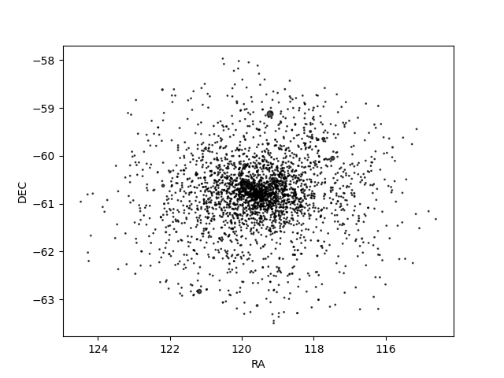
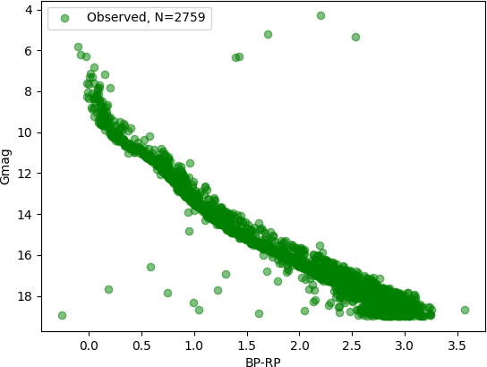
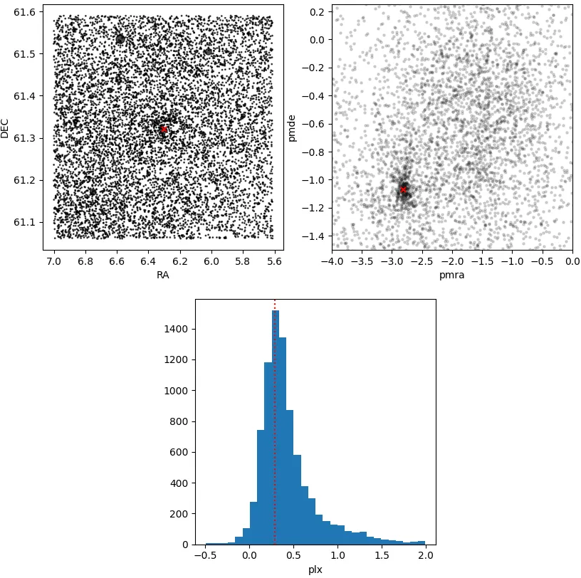

.. _cluster_load:

Loading your cluster
####################

Your cluster's data needs to be stored in a file format compatible with the
`pandas <https://pandas.pydata.org/>`_ package. The
`csv <https://en.wikipedia.org/wiki/Comma-separated_values>`_ format is probably the
most used but any compatible format is acceptable.

The first step is to load the file as a `pandas DataFrame
<https://pandas.pydata.org/docs/reference/api/pandas.DataFrame.html>`_:

.. code-block:: python

    import pandas as pd

    # Read the cluster's data file with pandas
    df = pd.read_csv("path_to_cluster_file")

After this, you can define a :py:class:`asteca.cluster.Cluster` object
simply by passing the dataframe and the the column names in your data file for the IDs,
right ascension, declination, magnitude, color, and their respective uncertainties.

.. code-block:: python

    import asteca

    # Generate a `cluster` object
    my_cluster = asteca.cluster(
        obs_df=df,
        ra='RA_ICRS',
        dec='DE_ICRS',
        magnitude="Gmag",
        e_mag="e_Gmag",
        color="BP-RP",
        e_color='e_BP-RP'
    )

That's it! You can now for example generate a quick coordinates plot with the
:py:func:`asteca.plot.radec` function:

.. code-block:: python

    import matplotlib.pyplot as plt

    ax = plt.subplot()
    asteca.plot.radec(my_cluster, ax)
    plt.show()

showing something like:

or a color-magnitude plot with the :py:func:`asteca.plot.cluster` function:

.. code-block:: python

    import matplotlib.pyplot as plt

    ax = plt.subplot(111)
    ax = my_cluster.clustplot(ax1)
    plt.show()

which should results in something like this:

The above example assumes that your data already contained the cluster *members* 
(however the user selected them), but a complete stellar field can also be loaded in
this object and processed to extract cluster's properties such as its center coordinates
and radius (see :ref:`structure`) as well as their membership probabilities
(see :ref:`membership`).

.. _structure:

Structure analysis
******************

Structural analysis includes a cluster's center coordinates estimation as well as the
estimation of its radius.

Center estimation
=================

The simplest structural analysis (and usually the first one to be required) is the
cluster's center estimation. **ASteCA** provides the
:py:meth:`get_center() <asteca.cluster.Cluster.get_center>` method to perform this
estimation.

.. important::
    A single algorithm is available for now called ``knn_5d`` and it requires that your
    :py:class:`my_cluster` object contains ``(RA, DEC, pmra, pmde, plx)`` data. A
    algorithm hat only requires ``(RA, DEC)``  will be added in future versions

Assuming you have a field that looks like this

.. figure:: ../_static/field.webp
   :align: center

you can estimate the center simply via:

.. code-block:: python

    my_cluster.get_center()

    >> Center coordinates found:
    >> radec_c        : (6.3049, 61.3218)
    >> pms_c          : (-2.811, -1.070)
    >> plx_c          : 0.288

The ``radec_c, pms_c, plx_c`` values containing the center coordinates will be stored in
your :py:class:`my_cluster` object as attributes and can be accessed to use later on,
for example to plot the center values found:

.. code-block:: python

    ax = plt.subplot(221)
    asteca.plot.radec(my_cluster, ax)
    plt.scatter(my_cluster.radec_c[0], my_cluster.radec_c[1], marker='x', s=25, c='r')

    ax = plt.subplot(222)
    plt.scatter(my_cluster.pmra_v, my_cluster.pmde_v, c='k', alpha=.15, s=5)
    plt.scatter(my_cluster.pms_c[0], my_cluster.pms_c[1], marker='x', s=25, c='r')
    plt.xlabel("pmra")
    plt.ylabel("pmde")

    ax = plt.subplot(223)
    plt.hist(my_cluster.plx_v, 30)
    plt.axvline(my_cluster.plx_c, c='r', ls=':')
    plt.xlabel("plx")

    plt.show()

Radius estimation
=================

A method to estimate the cluster's radius  will be added in future versions.
In the meantime you can manually add the attribute with:

.. code-block:: python

    my_cluster.radius = 0.1

where the value is always in units of degrees.

Number of members
=================

Estimating the number of members for a given cluster is a crucial step for the
membership analysis. Currently **ASteCA** integrates two methods to perform this
estimation, as shown in
:py:meth:`get_nmembers() <asteca.cluster.Cluster.get_nmembers>`.

If the estimated number is not a proper representation of the believed number of members
for this cluster, the user can easily input this value manually with:

.. code-block:: python

    my_cluster.N_cluster = 300