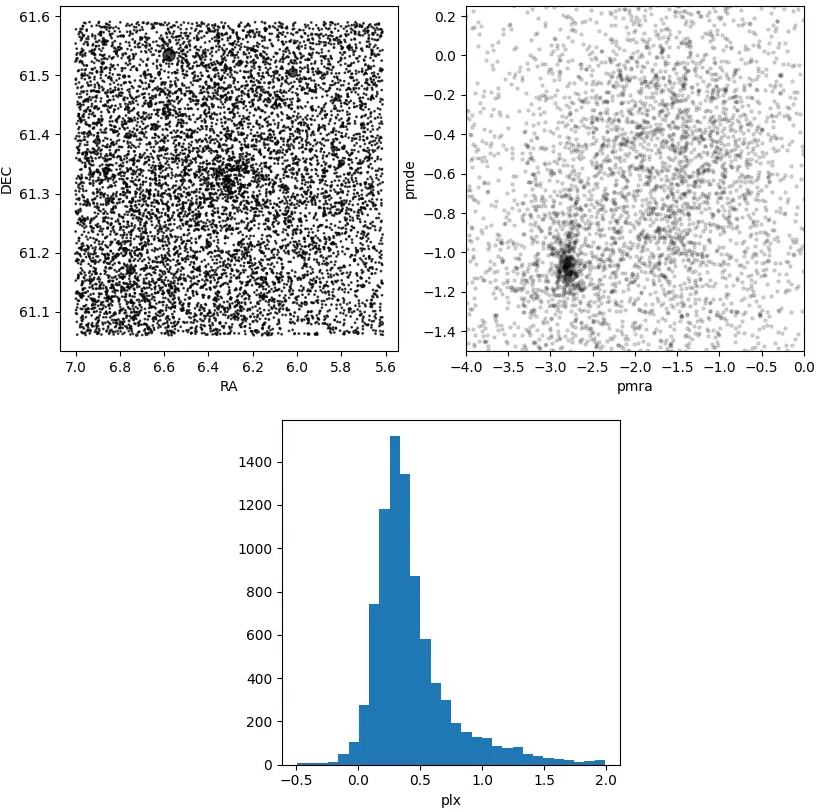
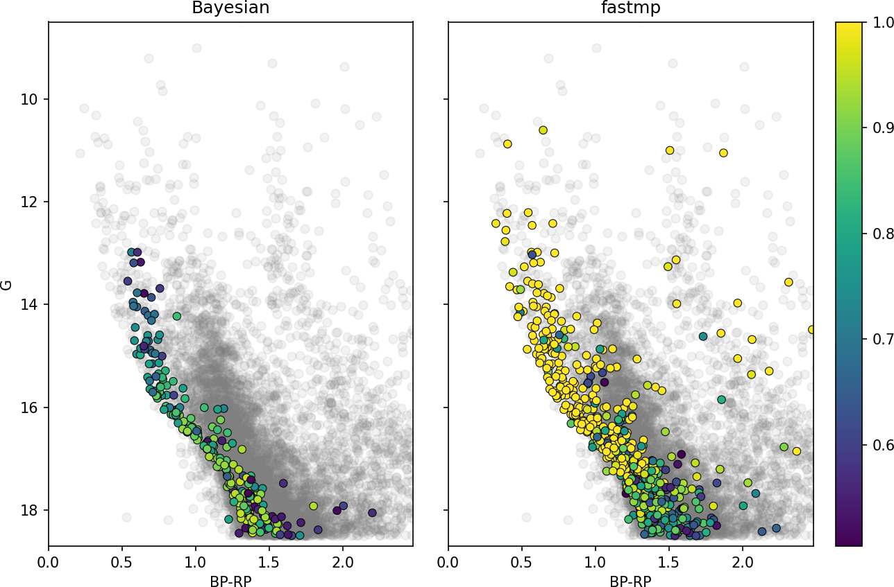

.. _membership:

Membership estimation
#####################

The :py:class:`asteca.membership` class allows estimating the membership probabilities
for all the stars in a given observed field. There are currently two methods included in
this class: :py:meth:`asteca.membership.Membership.bayesian` and
:py:meth:`asteca.membership.Membership.fastmp`.

The :py:meth:`bayesian` method was described in detail in the
`article <https://doi.org/10.1051/0004-6361/201424946>`__ where **ASteCA** was
originally introduced. The method requires ``(ra, dec)``  data and will use any extra
data dimensions stored in the :py:class:`Cluster <asteca.cluster.Cluster>` object, i.e.:
photometry, proper motions, and parallax. A minimum of two data dimensions are required,
in addition to ``(ra, dec)``. This method can produce membership probabilities on
photometric data alone.

The :py:meth:`fastmp` method was described in detail in the
`article <https://academic.oup.com/mnras/article/526/3/4107/7276628>`__
where the `Unified Cluster Catalogue (UCC) <https://ucc.ar/>`__ was introduced. The
method requires proper motions, and parallax data dimensions stored in the
:py:obj:`Cluster` object. Photometric data is not employed.

.. important::
    The only advantage of the :py:meth:`bayesian` method over the :py:meth:`fastmp`
    method is that the former works with photometric data. Hence it should only be used
    in cases were only photometric data is available, as :py:meth:`fastmp` is not only
    much faster but also more precise in those cases where proper motions and/or
    parallax data is available.

To use these methods the first step is to load an observed field, for example:

into a :py:obj:`Cluster` object and estimate the cluster's
center and radius (a radius value is only required by the :py:meth:`bayesian` method):

.. code-block:: python

    import pandas as pd
    import asteca

    field_df = pd.read_csv(path_to_field_file)

    my_field = asteca.cluster(
        ra=df['RA_ICRS'],
        dec=df['DE_ICRS'],
        pmra=df["pmRA"],
        pmde=df["pmDE"],
        plx=df["Plx"],
        e_pmra=df["e_pmRA"],
        e_pmde=df["e_pmDE"],
        e_plx=df["e_Plx"],
    )

    # Estimate the cluster's center coordinates
    my_field.get_center()

    # Add a radius attribute, required for the ``bayesian`` method
    my_field.radius = 0.15

    # Estimate the number of cluster members
    my_field.get_nmembers()

With this in place, you can define a :py:obj:`membership` object and apply either method or
all or them following:

.. code-block:: python

    # Define a ``membership`` object
    memb = asteca.membership(my_field)

    # Run ``fastmp`` method
    probs_fastmp = memb.fastmp()

    # Run ``bayesian`` method
    probs_bayes = memb.bayesian()

The results will naturally not be equivalent as both algorithms are rather different.

The :py:meth:`bayesian` algorithm for example tends to assign lower probabilities than
the :py:meth:`fastmp` algorithm.