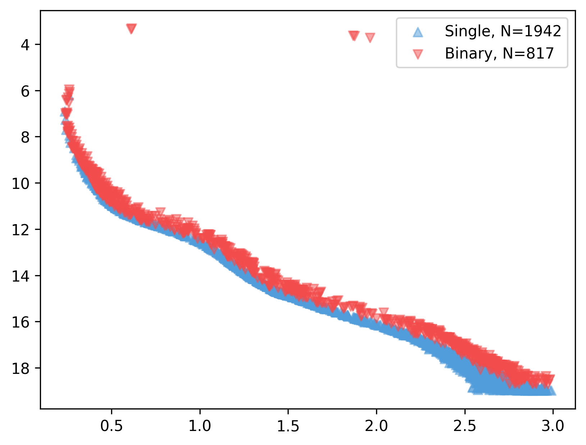
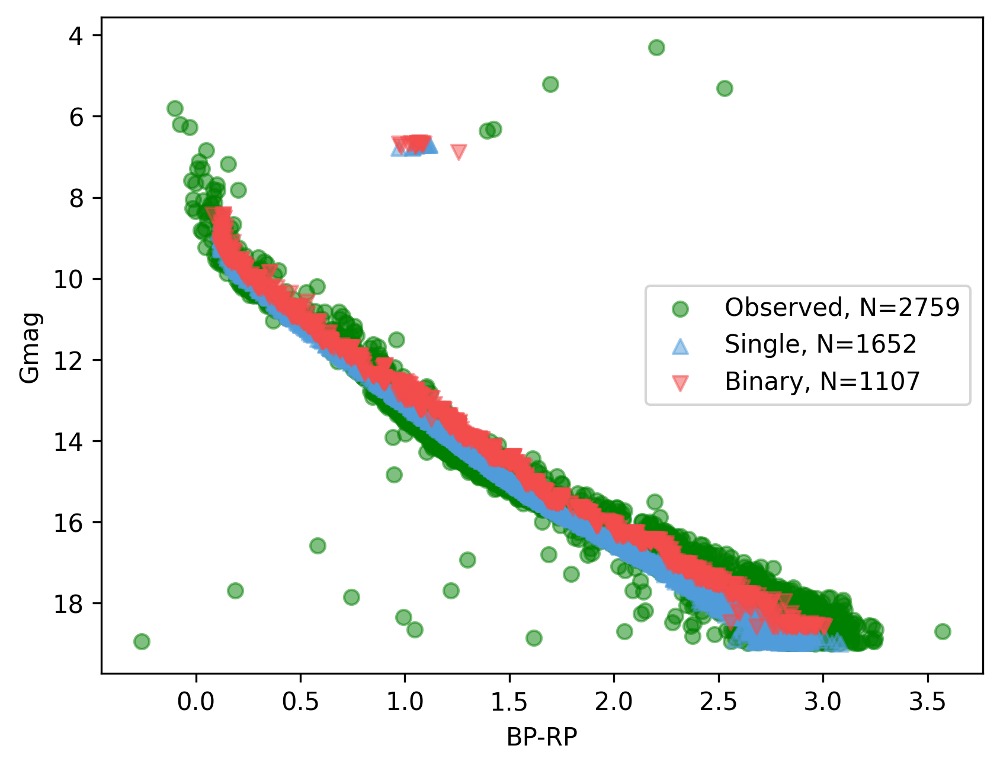

.. _synth_clusters:

Synthetic clusters
##################

The :py:class:`asteca.synthetic` class allows generating synthetic clusters from:

1. An :py:class:`asteca.isochrones.Isochrones` object
2. A :py:class:`asteca.cluster.Cluster` object for calibration
3. A dictionary of fixed fundamental parameters (optional)
4. A dictionary of free fundamental parameters to be fitted

The handling of a :class:`synthetic` object is explained in detail in the sub-sections
that follow.

.. _ref_defining:

Defining the object
*******************

To instantiate a :class:`synthetic` object you need to pass the :class:`isochrones`
object previously generated, as explained in the section :ref:`isochronesload`.

.. code-block:: python

    # Synthetic clusters object
    synthcl = asteca.synthetic(isochs)

This example will load the theoretical isochrones into the :class:`synthetic` object and
perform the required initial processing. This involves sampling an initial
mass function (IMF), and setting the distributions for the binary systems' mass ratio
and the differential reddening (these two last processes are optional).

The basic example above uses the default values for these three processes, but
they can be modified by the user at this stage via their arguments. These arguments
are (also see :py:mod:`asteca.synthetic`):

.. code-block:: console

    IMF_name : Initial mass function.
    max_mass : Maximum total initial mass.
    gamma    : Distribution for the mass ratio of the binary systems.
    ext_law  : Extinction law.
    DR_dist  : Distribution for the differential reddening.

The ``IMF_name`` and ``max_mass`` arguments are used to generate random mass samples from
a an IMF. This step is performed when the :py:mod:`asteca.synthetic` object is created
instead of every time a new synthetic cluster is generated, to improve the performance
of the code. The ``IMF_name`` argument must be one of those available in
:py:mod:`asteca.synthetic`. Currently these are associated to the following IMFs:

.. figure:: ../_static/IMFs.png
    :scale: 35%
    :align: center

as defined in `Salpeter (1995) <https://ui.adsabs.harvard.edu/abs/1955ApJ...121..161S/>`_,
`Kroupa (2001) <https://ui.adsabs.harvard.edu/abs/2001MNRAS.322..231K/>`_,
and `Chabrier et al. (2014) <https://ui.adsabs.harvard.edu/abs/2014ApJ...796...75C/>`_
(currently the default value). he ``max_mass`` argument simply fixes the total mass
value to be sampled. This value is related to the number of stars in the observed
cluster: it should be large enough to allow generating as many synthetic stars as those
observed.

The ``gamma`` argument ($\gamma$) defines the distribution of the mass ratio for the
binary systems. The mass ratio is the ratio of secondary masses to primary masses
in binary systems. It is written as $q=m_2/m_1\,(<=1)$ where $m_1$ and $m_2$ are the
masses of the primary and secondary star, respectively. As with the IMF, the
$q$ distribution is fixed, not fitted, to improve the performance.

We use ``gamma`` as an argument because the $q$ distribution is usually defined as a
power-law, where ``gamma`` or $\gamma$ is the exponent or power:

.. math::

    f(q) \approx q^{\gamma(m_1)}

Here, $f(q)$ is the distribution of $q$ (the mass-ratio) where $\gamma(m_1)$ means that
the value of $\gamma$ depends on the primary mass of the system.

The default selection is ``gamma=D&K``, with ``D&K`` meaning the primary mass-dependent
distribution by
`Duchene & Kraus (2013) <https://doi.org/10.1146/annurev-astro-081710-102602>`_
(see their Table 1 and Figure 3). The user can also select between the two distributions
by `Fisher et al. (2005) <https://doi.org/10.1111/j.1365-2966.2005.09193.x>`_ (stepped
and peaked, see their Table 3) and
`Raghavan et al. (2010) <https://doi.org/10.1088/0067-0049/190/1/1>`_ (see their Fig 16,
left). In practice they all look somewhat similar, as shown in the figure below for a
random IMF mass sampling.

.. figure:: ../_static/qdist_mass.png
    :scale: 35%
    :align: center

The Fisher distributions (top row) favor $q$ values closer to unity (i.e.: secondary
masses that are similar to the primary masses), while the Raghavan and Duchene & Kraus
distributions (bottom row) look a bit more uniform.

The user also select a float value for ``gamma``, which will be used as an
exponent in the power-law function $f(q) \approx q^{\gamma}$. The figure below shows
this distribution for three ``gamma`` ($\gamma$) values, where ``gamma=0`` means a
uniform distribution.

.. figure:: ../_static/qdist_unif.png
    :scale: 35%
    :align: center

The ``ext_law`` argument defines the extinction law as one of either ``CCMO`` or
``GAIADR3``. The first one corresponds to the model by
`Cardelli, Clayton & Mathis (1989) <https://ui.adsabs.harvard.edu/abs/1989ApJ...345..245C>`_, with updated coefficients for near-UV from
`O'Donnell (1994) <https://ui.adsabs.harvard.edu/abs/1994ApJ...422..158O>`_.
The second one is
`Gaia's (E)DR3 <https://www.cosmos.esa.int/web/gaia/edr3-extinction-law>`_,
color-dependent law (main sequence), only applicable to Gaia's photometry. If this law
is selected, **ASteCA** assumes that the magnitude and first color used are Gaia's ``G``
and ``BP-RP`` respectively. 

.. important::

    While ``CCMO`` allows different ``Rv`` values (which means this parameter can even
    be fitted), ``GAIADR3`` is to be used with ``Rv=3.1``. Please read the online
    documentation and its accompanying articles  to learn more about this law's
    limitations.

There are dedicated packages like
`dustapprox <https://mfouesneau.github.io/dustapprox/>`_,
`dust_extinction <https://dust-extinction.readthedocs.io/>`_ or
`extinction <https://extinction.readthedocs.io/en/latest/>`_
that can handle this process. We chose to employ our own implementation to increase the
performance. If you want to use a different extinction model, please drop me an
`email <mailto:gabrielperren@gmail.com>`_.

The ``DR_dist`` argument fixes the distribution used for the differential reddening, if
this parameter is fitted to a value other than 0 (see Section :ref:`ref_calibrating` for
more details on parameter fitting). This argument currently accepts one of two string
values: ``uniform`` (the default) or ``normal``. The differential reddening adds a
random amount to the total extinction parameter ``Av``, sampled from either a
`uniform <https://numpy.org/doc/stable/reference/random/generated/numpy.random.uniform.html>`_ or a
`normal <https://numpy.org/doc/stable/reference/random/generated/numpy.random.normal.html>`_
distribution.

.. _ref_calibrating:

Calibrating the object
**********************

After instantiating a ``synthcl`` object through a :py:class:`asteca.synthetic.Synthetic` class (using an :py:class:`asteca.isochrones.Isochrones` object and the required initial arguments: IMF, ``gamma``, etc), we need to calibrate it with our observed cluster.
This process collects required data from
the :py:class:`asteca.cluster.Cluster` object (defined as ``my_cluster`` in
:ref:`cluster_load`), as well as reading the fixed fundamental parameters (if any), and some initialization arguments.

The basic configuration looks like this:

.. code-block:: python

    # Fix some model parameters
    fix_params = {"alpha": 0., "beta": 1., "Rv": 3.1}
    # Synthetic cluster calibration object
    synthcl.calibrate(my_cluster, fix_params)

In the above example we calibrated our ``synthcl`` object with our ``my_cluster`` object
defined previously, and set three fundamental parameters as fixed: ``alpha, beta, Rv``.
The meaning of these parameters is explained in the following section, we will only
mention here that the ``fix_params`` dictionary is optional. If you choose not to fix
any parameters, then all the fundamental parameters will be expected when calling
the ``synthcl`` object to generate a synthetic cluster.

The photometric uncertainties in the synthetic clusters are modeled after the observed
photometric uncertainties. The algorithm employed by **ASteCA** is to simply transport
the observed uncertainty values in magnitude and color(s) to the generated synthetic
stars. This way no approximation to the distribution of photometric uncertainties is
required.

.. _ref_generating:

Generating synthetic clusters
*****************************

Once the calibration is complete, we can generate synthetic clusters by simply
passing a dictionary with the fundamental parameters to be fitted to the
:py:meth:`asteca.synthetic.Synthetic.generate` method. **ASteCA** currently accepts
eight parameters, related to three intrinsic and two extrinsic cluster characteristics:

- *Intrinsic*: metallicity (``met``), age (``loga``), and binarity (``alpha, beta``)
- *Extrinsic*: distance modulus (``dm``) and extinction related parameters (total
  extinction ``Av``, differential reddening ``DR``, ratio of total to selective
  extinction ``Rv``)

These five cluster characteristics and its eight associated parameters are described in
more depth in the following sub-sections.

Intrinsic parameters
====================

The valid ranges for the metallicity and logarithmic age are inherited from the
theoretical isochrone(s) loaded in the :py:class:`asteca.isochrones.Isochrones` object.

The metallicity, ``met``, can be modeled either as ``z`` or ``FeH`` as
explained in section :ref:`isoch_loading`. The age parameter, ``loga``, is modeled as the
logarithmic age.

The ``alpha, beta`` parameters determine the fraction of binary systems
in a synthetic cluster through the equation:

.. math::

    P_b(m_1) = \alpha + \beta \times \frac{m_1}{(1.4+m_1)}

where $P_b(m_1)$ is the probability that a star of (primary) mass $m_1$ is part of a
binary system. This equation comes from a fit to the multiplicity fraction presented
in `Offner et al. (2023) <https://ui.adsabs.harvard.edu/abs/2023ASPC..534..275O>`_ (see
their Fig. 1 and Table 1). The multiplicity fraction values in this work are primary
mass dependent, meaning that larger masses have much larger probabilities of being part
of a binary (or higher order) system than low mass stars. The values ``alpha=0.09,
beta=0.94`` produce a very reasonable fit to this multiplicity fraction distribution:

.. figure:: ../_static/binar_distr.png
    :scale: 35%
    :align: center

These are thus suggested as fixed values for the ``alpha, beta`` parameters. The user
can of course choose to fit either or both of them, or fix them to different values. For
example, fixing ``alpha=0.5, beta=0.0`` would produce a synthetic cluster with
approximately 50% of binary systems, distributed uniformly across masses 
(i.e.: not primary mass dependent).

Extrinsic parameters
====================

The extrinsic parameters are related to two external processes affecting stellar
clusters: their distance and the extinction that affects them. The distance is measured
by the distance modulus ``dm``, which is the amount added to the photometric magnitude
to position the cluster at the proper distance from us. 

The three remaining parameters are linked to the extinction process: the total
extinction ``Av``, the ratio of total to selective extinction ``Rv``, and the
differential reddening ``DR``.

The first two are related through the equation:

.. math::

    A_V = R_V \times E_{B-V}

Finally, the differential reddening parameter ``DR`` adds random scatter to the cluster
stars affectd by ``Av``. The distribution for this scatter is controlled setting the
argument ``DR_dist`` when the :class:`synthetic` object is instantiated (as explained in
:ref:`ref_defining`), which can currently be either a uniform or a normal distribution.

Generation
==========

Generating a synthetic cluster after calibrating the :class:`synthetic` object simply
requires calling the :meth:`generate()` method with a dictionary containing the
parameters that were not fixed.

In the section :ref:`ref_calibrating` the fixed parameters were:

.. code-block:: python

    fix_params = {"alpha": 0., "beta": 1., "Rv": 3.1}

which means that we can generate a synthetic cluster first storing the rest of the
required parameters in a dictionary (here called ``fit_params``):

.. code-block:: python

    # Define model parameters
    fit_params = {
        "met": 0.01,
        "loga": 9.87,
        "dm": 11.3,
        "Av": 0.15,
        "DR": 0.2,
    }

and finally calling the :meth:`generate()` method:

.. code-block:: python

    # Generate the synthetic cluster
    synth_clust = synthcl.generate(fit_params)

The ``synth_clust`` variable will store a ``numpy`` array of shape ``(Ndim, Nstars)``,
where ``Ndim=2`` if a single color is used and ``Ndim=3`` if two colors are being used,
and ``Nstars`` equals the number of observed stars in the :class:`cluster` object 
(this is true ony if the ``max_mass`` argument is large enough to allow generating as
many synthetic stars as those observed, otherwise fewer stars will be generated).

You can also generate a synthetic cluster passing all the available model parameters. To
do this, do not pass a dictionary of fixed model parameters when calibrating the
:class:`synthetic` object:

.. code-block:: python

    # Calibrate object
    synthcl.calibrate(my_cluster)

    # Define all available model parameters
    fit_params = {
        "met": 0.015,
        "loga": 8.75,
        "alpha": 0.0,
        "beta": 1.0,
        "dm": 8.5,
        "Av": 0.15,
        "DR": 0.0,
        "Rv": 3.1
    }

    # Generate the synthetic cluster
    synth_clust = synthcl.generate(fit_params)

Plotting
========

The generated synthetic clusters can be quickly plotted using the
:py:func:`asteca.plot.synthetic` function:

.. code-block:: python

    import matplotlib.pyplot as plt

    ax = plt.subplot()
    asteca.plot.synthetic(synthcl, ax, fit_params)
    plt.show()

which will produce something like this:

You can combine this with the :py:func:`asteca.plot.cluster` function
to generate a combined CMD plot:

.. code-block:: python

    import matplotlib.pyplot as plt
    ax = plt.subplot()
    asteca.plot.cluster(my_cluster, ax)
    asteca.plot.synthetic(synthcl, ax, fit_params)
    plt.show()

which produces:

Setting the ``isochplot`` argument to ``True`` in :py:func:`asteca.plot.synthetic`

.. code-block:: python

    asteca.plot.synthetic(synthcl, ax, fit_params, isochplot=True)

overlays the isochrone used as a building block for the synthetic cluster:

.. figure:: ../_static/obs_synthplot_isoch.png
    :scale: 35%
    :align: center

.. _masses_and_binarity:

Mass and binarity
*****************

The individual stellar masses, their probability of being binary systems, the total
binary fraction and the total cluster mass can all be estimated using methods available
in the :py:class:`synthetic <asteca.synthetic.Synthetic.synthetic>` object.

The first step is to call the
:py:meth:`get_models() <asteca.synthetic.Synthetic.get_models>` method. This method
requires three arguments: ``model`` which is a dictionary of parameters to be fitted 
(equivalent to the ``fit_params`` dictionary used to generate synthetic clusters), a
``model_std`` dictionary which contains the uncertainties (standard deviations)
associated to each parameter in the ``model`` dictionary, and a list with center
coordinates for the cluster in ``(RA, DEC)``. For example:

.. code-block:: python

    # Assuming alpha, beta, DR, and Rv were fixed when the object was calibrated
    model = {
        "met": 0.015,
        "loga": 8.75,
        "dm": 8.5,
        "Av": 0.15,
    }
    model_std = {
        "met": 0.001,
        "loga": 0.2,
        "dm": 0.25,
        "Av": 0.03,
    }
    # List that contains the (RA, DEC) center coordinates
    radec_c = [119.49, -60.77]    
    synthcl.get_models(model, model_std, radec_c)

This will store in the :py:class:`synthetic <asteca.synthetic.Synthetic.synthetic>`
object a sample of synthetic clusters (sampled from a normal distribution centered
on ``model`` with a STDDEV taken from ``model_std``) along with a few other
required data arrays. Once this is complete, the masses and binarity can be estimated
as shown in the following sub-sections.

Per star masses and binarity
============================

An estimation of the observed stars individual masses and their probability of belonging
to a binary system can be achieved via the
:py:meth:`stellar_masses() <asteca.synthetic.Synthetic.stellar_masses>`
method:

.. code-block:: python

    # Assuming `synthcl.get_models(model, model_std)` was already performed
    df_masses_bprob = synthcl.stellar_masses()

The returned variable ``df_masses_bprob`` is a ``pandas.Dataframe`` containing the
columns ``m1, m1_std, m2, m2_std, binar_prob``:

.. code-block:: python

     print(m1m2_bp_df)
                 m1    m1_std        m2    m2_std  binar_prob
     0     0.544963  0.015492  0.065701  0.042717       0.025
     1     1.435205  0.077494  0.512087  0.276861       0.600
     2     0.599977  0.015769  0.133876  0.017710       0.015
     3     1.068667  0.051011  0.096086  0.049249       0.010
     4     0.772404  0.033727  0.208318  0.108373       0.175
     ...        ...       ...       ...       ...         ...
     2754  0.351235  0.020715  0.231247  0.045607       0.990
     2755  6.001625  0.099839  2.254647  0.863841       0.895
     2756  0.633823  0.016124       NaN       NaN       0.000
     2757  0.582850  0.016541       NaN       NaN       0.000
     2758  0.414867  0.031577       NaN       NaN       0.000

These columns represent, for each observed star in the cluster under analysis, estimates
for:

- ``m1``: primary mass
- ``m1_std``: uncertainty of the primary mass
- ``m2``: secondary mass (under the assumption that this star belongs to a binary
  system)
- ``m2_std``: uncertainty of the secondary mass
- ``binar_prob``: probability of being a binary system 

If an observed star has ``binar_prob=0``, i.e. a zero probability of being a binary
system, then the mass value for its secondary star is a ``NaN`` value since no secondary
star could be assigned to it.

Total binary fraction
=====================

Since the fraction of synthetic binary systems is handled through the ``alpha, beta``
parameters, there is no *binary fraction* parameter than can be fitted using the
synthetic clusters. This parameter needs to be generated separately via the
:py:meth:`binary_fraction() <asteca.synthetic.Synthetic.binary_fraction>`
method as follows:

.. code-block:: python

    # Assuming `synthcl.get_models(model, model_std)` was already performed
    binar_f = synthcl.binary_fraction()

    # Print median and STDDEV values
    print("b_fr: {:.2f}+/-{:.2f}".format(np.median(binar_vals), np.std(binar_vals)))

    >> b_fr: 0.46+/-0.24

The ``binar_f``  variable will store an array with the distribution for the
total binary fraction estimate for the cluster. 

.. figure:: ../_static/binar_distr_obs.png
    :scale: 35%
    :align: center

As shown above, the user can obtain estimate values (e.g., median and STDDEV) from this
distribution, and use these as global estimates for the cluster's binary fraction.

Total cluster mass
==================

The total initial mass of a cluster can be split in several parts, as follows:

.. math::

    M_{i} = M_{a} + M_{ev} + M_{dyn}

where $M_{i}$ is the initial mass, $M_{a}$ is the actual mass, $M_{ev}$ is the mass
**lost** via stellar evolution, and $M_{dyn}$ is the mass **lost** through dynamical
effects (or *dissolution*). The actual mass $M_{a}$ can be further split as:

.. math::

    M_{a} = M_{obs} + M_{phot}

where $M_{obs}$ is the observed mass (e.g.: the sum of individual stellar masses in the
observed CMD) and $M_{phot}$ is the mass **unobserved** due to photometric effects (i.e:
the low mass stars beyond the maximum magnitude cut). The total initial mass can thus be
written as the sum of all of its components as:

.. math::

    M_{i} = M_{obs} + M_{phot} + M_{ev} + M_{dyn}

The actual mass $M_{a}$ is estimated by **ASteCA** starting from the
observed mass $M_{obs}$ (approximated by a sampled synthetic cluster with parameters
matching those of the observed cluster) and using an IMF sample to infer the missing
portion below the maximum magnitude cut, i.e. the photometric mass $M_{phot}$. As stated
above, the sum of these two is equivalent to $M_{a}$.

Following `Lamers et al. (2005)
<https://www.aanda.org/articles/aa/abs/2005/37/aa2241-04/aa2241-04.html>`_ Eq. 7,
the initial mass can be estimated via:

.. math::

    M_i \simeq \left\{ M_a^{\gamma} + \frac{\gamma t}{t_0} \right\}^{1/\gamma} \mu_{\text
    {ev}}(Z, t)^{-1}

where $M_{a}$ is the actual mass, $t$ is the cluster's age, $\mu_{\text{ev}}(Z, t)$
is the "*fraction of the initial mass of the cluster that would have remained at age t,
if stellar evolution would have been the only mass loss mechanism*", ${\gamma}$ is a
constant, and $t_{0}$ is "*a constant that depends on the tidal field of the particular
galaxy in which the cluster moves and on the ellipticity of its orbit*".

The $\gamma$ constant is usually set to 0.62 and the $\mu_{\text{ev}}(Z, t)$ parameter
can be estimated using a 3rd degree polynomial as shown in 
`Lamers, Baumgardt & Gieles (2010) <http://adsabs.harvard.edu/abs/2010MNRAS.409..305L>`_,
Table B2.

The dissolution parameter $t_0$ of a cluster is the hypothetical dissolution
time-scale of a cluster of 1 $M_{\odot}$ and is related to the disruption time
$t_{dis}$ (defined as the time when 5% of the initial number of stars remain in the
cluster) via:

.. math::

    t_{dis} = t_{0} M_i^{\gamma}

Furthermore, $t_0$ is expected to depend on the ambient density $\rho_{amb}$ at the
location of the clusters in the Galaxy as:

.. math::

    t_{0} = C_{env} (1-\epsilon) 10^{-4\gamma} \rho_{amb}^{-1/2}

where $C_{env}$ is a constant set to 810 Myr (`Lamers, Gieles & Zwart 2005
<https://www.aanda.org/articles/aa/abs/2005/01/aa1476/aa1476.html>`_), $\epsilon$ is
the eccentricity of the orbit, and $\rho_{amb}$ is the ambient density which depends on
the adopted gravitational potential field.

Following `Angelo et al. (2023)
<https://ui.adsabs.harvard.edu/abs/2023MNRAS.522..956A/abstract>`_, **ASteCA** uses by
default $\epsilon=0.08$ and estimates $\rho_{amb}$ as:

.. math::

    \rho_{\text{amb}} = \frac{1}{4\pi G} \nabla^2 \left[ \phi_B(r) + \phi_D(\rho, z) + \phi_H(r) \right]

where $\phi_B(r),\, \phi_D(\rho, z),\, \phi_H(r)$ are the bulge, disc and halo
potentials, respectively (see Eqs 8, 9 and 10 of the Angelo et al. article to see how
these are modeled).

Finally, plugging these values into the equation for $M_{i}$, we can estimate all the
masses and their uncertainties through a bootstrap process. **ASteCA** applies all these
processes via the
:py:meth:`cluster_masses() <asteca.synthetic.Synthetic.cluster_masses>`
method as:

.. code-block:: python

    masses_dict = synthcl.cluster_masses()
    
The returned dictionary contains arrays with the distributions of masses for each
mass. Their median and STDDEV values can be extracted for example with:

.. code-block:: python

    # Print the median mass values and their STDDEV
    for k, arr in masses_dict.items():
        print("{:<8}: {:.0f}+/-{:.0f}".format(k, np.median(arr), np.std(arr)))

    >> M_init  : 4063+/-620
    >> M_actual: 2938+/-282
    >> M_obs   : 2463+/-151
    >> M_phot  : 454+/-148
    >> M_evol  : 827+/-225
    >> M_dyn   : 298+/-205
