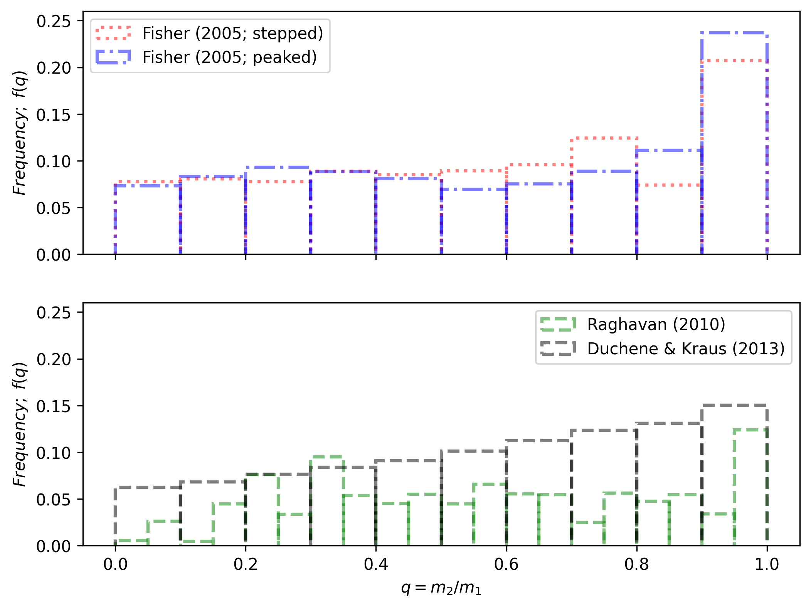
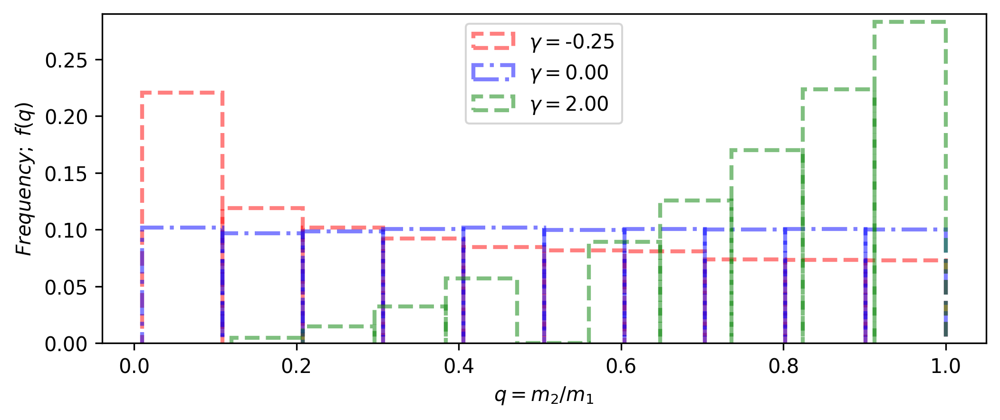
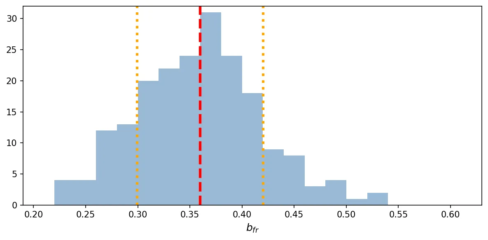

.. _synthetic_module:

Synthetic
#########

The :py:class:`asteca.synthetic` class allows generating synthetic clusters from:

1. A :py:class:`asteca.isochrones.Isochrones` object
2. A dictionary of fundamental parameters
3. Optionally, a :py:class:`asteca.cluster.Cluster` object for calibration

The handling of a :class:`synthetic` object is explained in detail in the sub-sections
that follow.

.. _ref_defining:

Defining the object
*******************

To instantiate a :class:`synthetic` object you need to pass the :class:`isochrones`
object previously generated, as explained in the section :ref:`isochrones_module`.

.. code-block:: python

    # Synthetic clusters object
    synthcl = asteca.synthetic(isochs)

This example will load the theoretical isochrones into the :class:`synthetic` object and
perform the required initial processing. This involves sampling an initial
mass function (IMF), and setting the distributions for the binary systems' mass ratio
and the differential reddening (these two last processes are optional).

The basic example above uses the default values for these three processes, but
they can be modified by the user at this stage via their arguments. These arguments
are (also see :py:class:`asteca.synthetic.Synthetic`):

.. code-block:: console

    IMF_name : Initial mass function.
    max_mass : Maximum total initial mass.
    gamma    : Distribution for the mass ratio of the binary systems.
    ext_law  : Extinction law.
    DR_dist  : Distribution for the differential reddening.

The ``IMF_name`` and ``max_mass`` arguments are used to generate random mass samples from
a an IMF. This step is performed when the :py:class:`asteca.synthetic.Synthetic` object
is created instead of every time a new synthetic cluster is generated, to improve the
performance of the code. The ``IMF_name`` argument must be one of those available in
:py:class:`asteca.synthetic.Synthetic`. Currently these are associated to the
following IMFs:

.. figure:: ../_static/IMFs.png
    :scale: 35%
    :align: center

as defined in `Salpeter (1995) <https://ui.adsabs.harvard.edu/abs/1955ApJ...121..161S/>`_,
`Kroupa (2001) <https://ui.adsabs.harvard.edu/abs/2001MNRAS.322..231K/>`_,
and `Chabrier et al. (2014) <https://ui.adsabs.harvard.edu/abs/2014ApJ...796...75C/>`_
(currently the default value). he ``max_mass`` argument simply fixes the total mass
value to be sampled. This value is related to the number of stars in the observed
cluster: it should be large enough to allow generating as many synthetic stars as those
observed.

The ``gamma`` argument (:math:`\gamma`) defines the distribution of the mass ratio for
the binary systems. The mass ratio is the ratio of secondary masses to primary masses
in binary systems. It is written as :math:`q=m_2/m_1\,(<=1)` where :math:`m_1` and
:math:`m_2` are the masses of the primary and secondary star, respectively. As with
the IMF, the :math:`q` distribution is fixed, not fitted, to improve the performance.

We use ``gamma`` as an argument because the :math:`q` distribution is usually defined
as a power-law, where ``gamma`` or :math:`\gamma` is the exponent or power:

.. math::

    f(q) \approx q^{\gamma(m_1)}

Here, :math:`f(q)` is the distribution of :math:`q` (the mass-ratio) where 
:math:`\gamma(m_1)` means that the value of :math:`\gamma` depends on the primary mass
of the system (this dependence is only true for the Duchene & Kraus distribution, see
below).

The default selection is ``gamma=D&K``, with ``D&K`` meaning the primary mass-dependent
distribution by
`Duchene & Kraus (2013) <https://doi.org/10.1146/annurev-astro-081710-102602>`_
(see their Table 1 and Figure 3). The user can also select between the two distributions
by `Fisher et al. (2005) <https://doi.org/10.1111/j.1365-2966.2005.09193.x>`_ (stepped
and peaked, see their Table 3) and
`Raghavan et al. (2010) <https://doi.org/10.1088/0067-0049/190/1/1>`_ (see their Fig 16,
left). In practice they all look somewhat similar, as shown in the figure below for a
random IMF mass sampling.

The Fisher distributions (top row) favor :math:`q` values closer to unity (i.e.:
secondary masses that are similar to the primary masses), while the Raghavan and
Duchene & Kraus distributions (bottom row) look a bit more uniform.

The user can also select a float value for ``gamma``, which will be used as an
exponent in the power-law function :math:`f(q) \approx q^{\gamma}`. The figure below
shows this distribution for three ``gamma`` (:math:`\gamma`) values, where ``gamma=0``
means a uniform distribution.

Only the Duchene & Kraus distribution is primary-mass dependent. The Fisher and Raghavan
distributions, as well as the distributions set by the user via a float value for
``gamma``, are independent of mass values.

The ``ext_law`` argument defines the extinction law as one of either ``CCMO`` or
``GAIADR3``. The first one corresponds to the model by
`Cardelli, Clayton & Mathis (1989) <https://ui.adsabs.harvard.edu/abs/1989ApJ...345..245C>`_, with updated coefficients for near-UV from
`O'Donnell (1994) <https://ui.adsabs.harvard.edu/abs/1994ApJ...422..158O>`_.
The second one is
`Gaia's (E)DR3 <https://www.cosmos.esa.int/web/gaia/edr3-extinction-law>`_,
color-dependent law (main sequence), only applicable to Gaia's photometry. If this law
is selected, **ASteCA** assumes that the magnitude and first color used are Gaia's ``G``
and ``BP-RP`` respectively. 

.. important::

    While ``CCMO`` allows different ``Rv`` values (which means this parameter can even
    be fitted), ``GAIADR3`` is to be used with ``Rv=3.1``. Please read the online
    documentation and its accompanying articles  to learn more about this law's
    limitations.

There are dedicated packages like
`dustapprox <https://mfouesneau.github.io/dustapprox/>`_,
`dust_extinction <https://dust-extinction.readthedocs.io/>`_ or
`extinction <https://extinction.readthedocs.io/en/latest/>`_
that can handle this process. We chose to employ our own implementation to increase the
performance. If you want to use a different extinction model, please drop me an
`email <mailto:gabrielperren@gmail.com>`_.

The ``DR_dist`` argument fixes the distribution used for the differential reddening, if
this parameter is fitted to a value other than 0 (see Section :ref:`ref_calibrating` for
more details on parameter fitting). This argument currently accepts one of two string
values: ``uniform`` (the default) or ``normal``. The differential reddening adds a
random amount to the total extinction parameter ``Av``, sampled from either a
`uniform <https://numpy.org/doc/stable/reference/random/generated/numpy.random.uniform.html>`_ or a
`normal <https://numpy.org/doc/stable/reference/random/generated/numpy.random.normal.html>`_
distribution.

.. _ref_calibrating:

Calibrating
***********

The calibration process is applied after instantiating a :class:`synthetic` object as
described in the previous section. This process is optional and it is aimed at collecting
data from an observed cluster loaded in a :py:class:`asteca.cluster.Cluster` object
(defined as ``my_cluster`` in :ref:`cluster_module`).

The calibration is performed via the :py:meth:`asteca.synthetic.Synthetic.calibrate`
method:

.. code-block:: python

    # Synthetic cluster calibration
    synthcl.calibrate(my_cluster)

This will extract the following information from the observed cluster:

- maximum observed photometric magnitude
- number of observed stars
- distribution of photometric uncertainties

The algorithm employed by **ASteCA** is to simply transport the observed uncertainty
values in magnitude and color(s) to the generated synthetic stars. This way no
approximation to the distribution of photometric uncertainties is required.

This process is optional, the user can generate synthetic clusters without calibrating
the :class:`synthetic` object. In this case, the synthetic clusters will be generated
with a given number of observed stars (default value is 100 but the user can select any
other value), the maximum photometric magnitude allowed by the loaded isochrones, and
no photometric uncertainties added.

.. _ref_generating:

Generating
**********

To generate synthetic clusters the user is required to pass a dictionary with
fundamental parameters  to the :py:meth:`asteca.synthetic.Synthetic.generate` method.
**ASteCA** currently requires eight parameters, related to intrinsic and extrinsic
cluster characteristics:

- *Intrinsic*: metallicity (``met``), age (``loga``), and binarity (``alpha, beta``)
- *Extrinsic*: distance modulus (``dm``) and extinction related parameters (total
  extinction ``Av``, differential reddening ``DR``, ratio of total to selective
  extinction ``Rv``)

These eight parameters are described in more depth in the following sub-sections.
An example of this dictionary of parameters and the generation of a synthetic cluster
is shown below:

.. code-block:: python

    # Define model parameters
    params = {
        "met": 0.01,
        "loga": 9.87,
        "alpha": 0.01,
        "beta": 1.,
        "Rv": 3.1,
        "dm": 11.3,
        "Av": 0.15,
        "DR": 0.2,
    }

    # Generate the synthetic cluster
    synth_clust = synthcl.generate(fit_params)

The notebook :ref:`synth_ntbk` contains more information and examples on how to
generate synthetic clusters with **ASteCA**.

Intrinsic parameters
====================

The valid ranges for the metallicity and logarithmic age are inherited from the
theoretical isochrone(s) loaded in the :py:class:`asteca.isochrones.Isochrones` object.

The metallicity, ``met``, can be modeled either as ``z`` or ``FeH`` as
explained in section :ref:`isochrones_module`. The age parameter, ``loga``, is modeled
as the logarithmic age.

The ``alpha, beta`` parameters determine the fraction of binary systems
in a synthetic cluster through the equation:

.. math::

    P_b(m_1) = \alpha + \beta \times \frac{m_1}{(1.4+m_1)}

where :math:`P_b(m_1)` is the probability that a star of (primary) mass :math:`m_1` is
part of a binary system. This equation comes from a fit to the multiplicity fraction
presented in `Offner et al. (2023) <https://ui.adsabs.harvard.edu/abs/2023ASPC..534..275O>`_ (see their Fig. 1 and Table 1). The multiplicity fraction values
in this work are primary mass dependent, meaning that larger masses have much larger
probabilities of being part of a binary (or higher order) system than low mass stars.
The values ``alpha=0.09, beta=0.94`` produce a very reasonable fit to this multiplicity fraction distribution:

.. figure:: ../_static/binar_distr.png
    :scale: 35%
    :align: center

These are thus suggested as fixed values for the ``alpha, beta`` parameters. The user
can of course choose to fit either or both of them, or fix them to different values. For
example, fixing ``alpha=0.5, beta=0.0`` would produce a synthetic cluster with
approximately 50% of binary systems, distributed uniformly across masses 
(i.e.: not primary mass dependent).

Extrinsic parameters
====================

The extrinsic parameters are related to two external processes affecting stellar
clusters: their distance and the extinction that affects them. The distance is measured
by the distance modulus ``dm``, which is the amount added to the photometric magnitude
to position the cluster at the proper distance from us. 

The three remaining parameters are linked to the extinction process: the total
extinction ``Av``, the ratio of total to selective extinction ``Rv``, and the
differential reddening ``DR``.

The first two are related through the equation:

.. math::

    A_V = R_V \times E_{B-V}

Finally, the differential reddening parameter ``DR`` adds random scatter to the cluster
stars affectd by ``Av``. The distribution for this scatter is controlled setting the
argument ``DR_dist`` when the :class:`synthetic` object is instantiated (as explained in
:ref:`ref_defining`), which can currently be either a uniform or a normal distribution.

.. _masses_and_binarity:

Mass and binarity
*****************

The individual stellar masses, their probability of being binary systems, the total
binary fraction and the total cluster mass of an observed cluster can all be estimated
using methods available in the
:py:class:`synthetic <asteca.synthetic.Synthetic.synthetic>` object.

The first step is to call the
:py:meth:`get_models() <asteca.synthetic.Synthetic.get_models>` method (were we assume
that the ``synthcl`` object was previously calibrated as described in
:ref:`ref_calibrating`).
This method requires two arguments: ``model`` which is a dictionary of parameters to be
fitted  (equivalent to the ``params`` dictionary used to generate synthetic clusters),
and a ``model_std`` dictionary which contains the uncertainties (standard deviations)
associated to each parameter in the ``model`` dictionary. For example:

.. code-block:: python

    # Assuming alpha, beta, DR, and Rv were fixed when the object was calibrated
    model = {
        "met": 0.015,
        "loga": 8.75,
        "alpha": 0.01,
        "beta": 1.,
        "Rv": 3.1,
        "dm": 8.5,
        "Av": 0.15,
        "DR": 0.2
    }

    model_std = {
        "met": 0.001,
        "loga": 0.2,
        "alpha": 0.0,
        "beta": 0.1,
        "Rv": 0.0,
        "dm": 0.2,
        "Av": 0.03,
        "DR": 0.0
    }
    synthcl.get_models(model, model_std)

This method will store in the :py:class:`synthetic <asteca.synthetic.Synthetic.synthetic>`
object a number of synthetic clusters, sampled from a normal distribution centered
on ``model`` values with STDDEVs taken from the ``model_std`` values.
By default ``200`` models are generated, this can be changed via the ``N_models``
parameter.

Notice that some of the parameters above have STDDEV values of ``0.0``
in the ``model_std`` dictionary; this means that these parameters are fixed in the
values shown in the ``model`` dictionary.

After calling this method, the individual stellar masses and binarity, cluster total
mass and binarity can be estimated as shown in the following sub-sections.

Per star masses and binarity
============================

An estimation of the observed stars individual masses and their probability of belonging
to a binary system can be achieved via the
:py:meth:`stellar_masses() <asteca.synthetic.Synthetic.stellar_masses>`
method:

.. code-block:: python

    # Assuming `synthcl.get_models(model, model_std)` was already called
    df_masses_bprob = synthcl.stellar_masses()

The returned variable ``df_masses_bprob`` is a dictionary containing the
columns ``m1, m1_std, m2, m2_std, binar_prob``:

.. code-block:: python

    # Convert the dictionary to a pandas DataFrame for prettier printing
    import pandas as pd
    m1m2_bp_df = pd.DataFrame(df_masses_bprob)

    print(m1m2_bp_df)
             m1    m1_std        m2    m2_std  binar_prob
    0     0.544963  0.015492  0.065701  0.042717       0.025
    1     1.435205  0.077494  0.512087  0.276861       0.600
    2     0.599977  0.015769  0.133876  0.017710       0.015
    3     1.068667  0.051011  0.096086  0.049249       0.010
    4     0.772404  0.033727  0.208318  0.108373       0.175
    ...        ...       ...       ...       ...         ...
    2754  0.351235  0.020715  0.231247  0.045607       0.990
    2755  6.001625  0.099839  2.254647  0.863841       0.895
    2756  0.633823  0.016124       NaN       NaN       0.000
    2757  0.582850  0.016541       NaN       NaN       0.000
    2758  0.414867  0.031577       NaN       NaN       0.000

These columns represent, for each observed star in the cluster under analysis, estimates
for:

- ``m1``: primary mass
- ``m1_std``: uncertainty of the primary mass
- ``m2``: secondary mass (under the assumption that this star belongs to a binary
  system)
- ``m2_std``: uncertainty of the secondary mass
- ``binar_prob``: probability of being a binary system 

If an observed star has ``binar_prob=0``, i.e. a zero probability of being a binary
system, then the mass value for its secondary star is a ``NaN`` value since no secondary
star could be assigned to it.

Total binary fraction
=====================

Since the fraction of synthetic binary systems is handled through the ``alpha, beta``
parameters, there is no *binary fraction* parameter than can be fitted using the
synthetic clusters. This parameter needs to be generated separately via the
:py:meth:`binary_fraction() <asteca.synthetic.Synthetic.binary_fraction>`
method as follows:

.. code-block:: python

    # Assuming `synthcl.get_models(model, model_std)` was already called
    binar_f = synthcl.binary_fraction()

    # Print median and STDDEV values
    print("b_fr: {:.2f}+/-{:.2f}".format(np.median(binar_vals), np.std(binar_vals)))

    >> b_fr: 0.36+/-0.06

The ``binar_f``  variable will store an array with the distribution for the
total binary fraction estimate for the cluster. 

As shown above, the user can obtain estimate values (e.g., median and STDDEV) from this
distribution, and use these as global estimates for the cluster's binary fraction.

Total cluster mass
==================

The total initial mass of a cluster can be split in several parts, as follows:

.. math::
    :label: eq_Mi1

    M_{i} = M_{a} + M_{ev} + M_{dyn}

where :math:`M_{i}` is the initial mass, :math:`M_{a}` is the actual mass,
:math:`M_{ev}` is the mass **lost** via stellar evolution, and :math:`M_{dyn}` is
the mass **lost** through dynamical effects (or *dissolution*). The actual mass
:math:`M_{a}` can be further split as:

.. math::

    M_{a} = M_{obs} + M_{phot}

where :math:`M_{obs}` is the observed mass (e.g.: the sum of individual stellar masses
in the observed CMD) and :math:`M_{phot}` is the mass **unobserved** due to photometric
effects (i.e: the low mass stars beyond the maximum magnitude cut). The total initial
mass can thus be written as the sum of all of its components as:

.. math::

    M_{i} = M_{obs} + M_{phot} + M_{ev} + M_{dyn}

The actual mass :math:`M_{a}` is estimated by **ASteCA** combining the observed and
photometric masses. The observed mass :math:`M_{obs}` is approximated as the sum of the
individual stellar masses of many synthetic clusters, sampled with parameters
matching those of the observed cluster. The photometric mass :math:`M_{phot}` is inferred
by summing the mass that exists below the mass value associated to the maximum observed
magnitude in the cluster. This requires sampling an IMF with a very large mass, and
obtaining the ratio of :math:`M_{obs}` to total mass; this ratio is the applied to the
sum of masses below the mass cut in the IMF to estimate :math:`M_{phot}`.
As stated above, the sum of these two masses is equivalent to :math:`M_{a}`.

Following `Lamers et al. (2005)
<https://www.aanda.org/articles/aa/abs/2005/37/aa2241-04/aa2241-04.html>`_ Eq. 7,
the initial mass can be estimated via:

.. math::
    :label: eq_Mi2

    M_i \simeq \left\{ M_a^{\gamma} + \frac{\gamma t}{t_0} \right\}^{1/\gamma} \mu_{\text
    {ev}}(Z, t)^{-1}

where :math:`M_{a}` is the actual mass, :math:`t` is the cluster's age,
:math:`\mu_{\text{ev}}(Z, t)` is the "*fraction of the initial mass of the cluster that
would have remained at age t, if stellar evolution would have been the only mass
loss mechanism*", :math:`{\gamma}` is a constant, and :math:`t_{0}` is "*a constant that
depends on the tidal field of the particular galaxy in which the cluster moves and on
the ellipticity of its orbit*".

The :math:`\gamma` constant is usually set to 0.62 and the
:math:`\mu_{\text{ev}}(Z, t)` parameter can be estimated using a 3rd degree polynomial
as shown in 
`Lamers, Baumgardt & Gieles (2010) <http://adsabs.harvard.edu/abs/2010MNRAS.409..305L>`_,
Table B2.

The dissolution parameter :math:`t_0` of a cluster is the hypothetical dissolution
time-scale of a cluster of 1 :math:`M_{\odot}` and is related to the disruption time
:math:`t_{dis}` (defined as the time when 5% of the initial number of stars remain in
the cluster) via:

.. math::

    t_{dis} = t_{0} M_i^{\gamma}

Furthermore, :math:`t_0` is expected to depend on the ambient density
:math:`\rho_{amb}` at the location of the clusters in the Galaxy as:

.. math::

    t_{0} = C_{env} (1-\epsilon) 10^{-4\gamma} \rho_{amb}^{-1/2}

where :math:`C_{env}` is a constant set to 810 Myr (`Lamers, Gieles & Zwart 2005
<https://www.aanda.org/articles/aa/abs/2005/01/aa1476/aa1476.html>`_),
:math:`\epsilon` is the eccentricity of the orbit, and :math:`\rho_{amb}` is the ambient
density which depends on the adopted gravitational potential field.

Following `Angelo et al. (2023)
<https://ui.adsabs.harvard.edu/abs/2023MNRAS.522..956A/abstract>`_, **ASteCA** uses by
default :math:`\epsilon=0.08` and estimates :math:`\rho_{amb}` as:

.. math::

    \rho_{\text{amb}} = \frac{1}{4\pi G} \nabla^2 \left[ \phi_B(r) + \phi_D(\rho, z) + \phi_H(r) \right]

where :math:`\phi_B(r),\, \phi_D(\rho, z),\, \phi_H(r)` are the bulge, disc and halo
potentials, respectively (see Eqs 8, 9 and 10 of the Angelo et al. article to see how
these are modeled). The user can also use a custom :math:`\rho_{\text{amb}}` value,
bypassing this estimation.

Plugging these values into Eq :eq:`eq_Mi2`, we can obtain an estimate of :math:`M_{i}`.
With this value we can then obtain :math:`M_{ev}` through the
:math:`\mu_{\text{ev}}(Z, t)` parameter as:

.. math::

    M_{ev} = M_{i}  \times [1 - \mu_{\text{ev}}(Z, t)]

Finally, the last remaining mass is the dynamical mass which we estimate simply
using Eq :eq:`eq_Mi1` as:

.. math::

    M_{dyn} = M_{i} - M_{a} - M_{ev}

The uncertainties are obtained through a bootstrap process. **ASteCA** applies all these
processes via the
:py:meth:`cluster_masses() <asteca.synthetic.Synthetic.cluster_masses>`
method (requires ``(ra, dec)`` center coordinates):

.. code-block:: python

    # Estimate the ``(ra, dec)`` center via the ``get_center("kde_2d")`` method
    my_cluster.get_center("kde_2d")
    masses_dict = synthcl.cluster_masses(radec_c=my_cluster.radec_c)
    
The returned dictionary contains arrays with the distributions of masses for each
mass. Their median and STDDEV values can be extracted for example with:

.. code-block:: python

    # Print the median mass values and their STDDEV
    for k, arr in masses_dict.items():
        print("{:<8}: {:.0f}+/-{:.0f}".format(k, np.median(arr), np.std(arr)))

    >> M_init  : 4063+/-620
    >> M_actual: 2938+/-282
    >> M_obs   : 2463+/-151
    >> M_phot  : 454+/-148
    >> M_evol  : 827+/-225
    >> M_dyn   : 298+/-205
