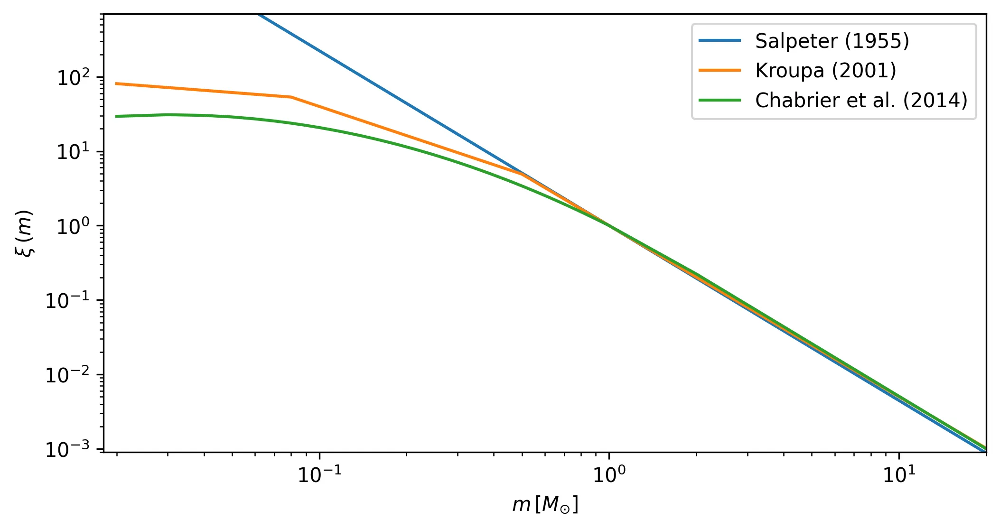
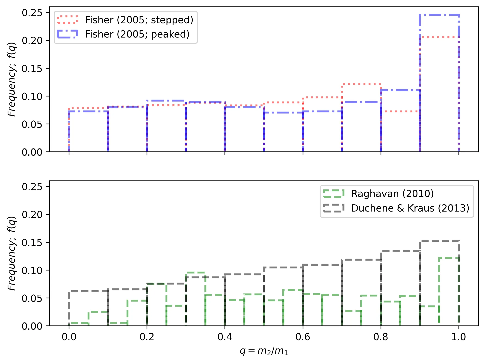
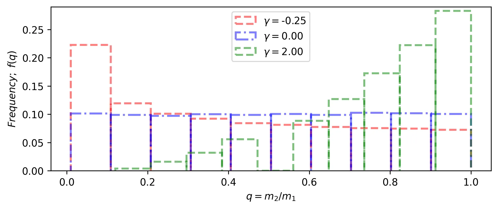
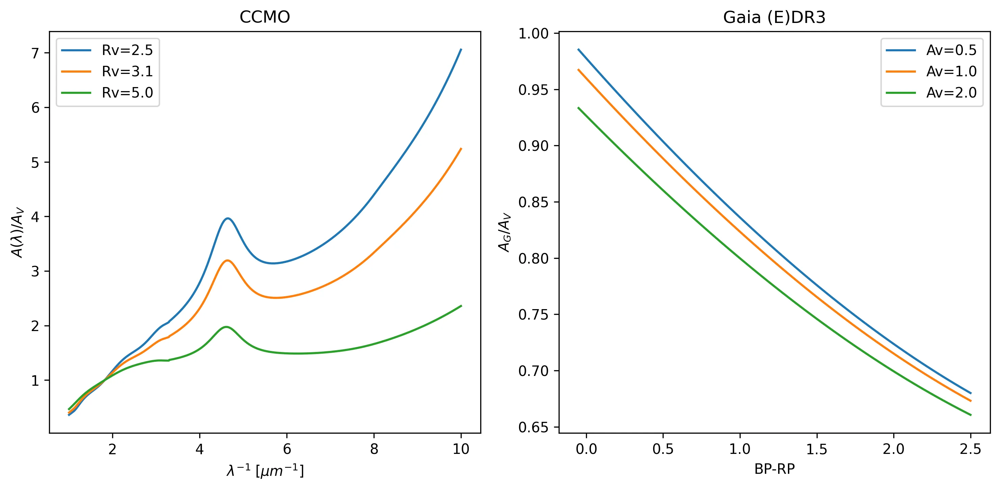
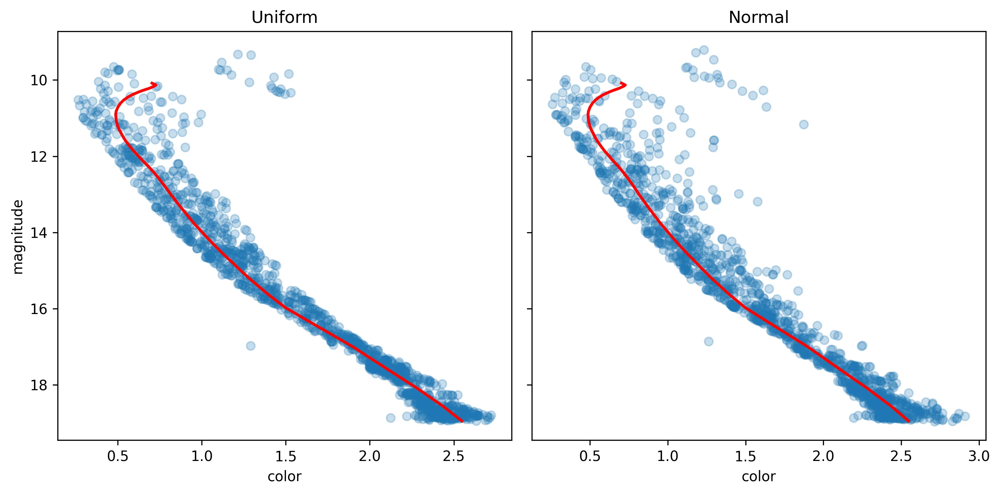
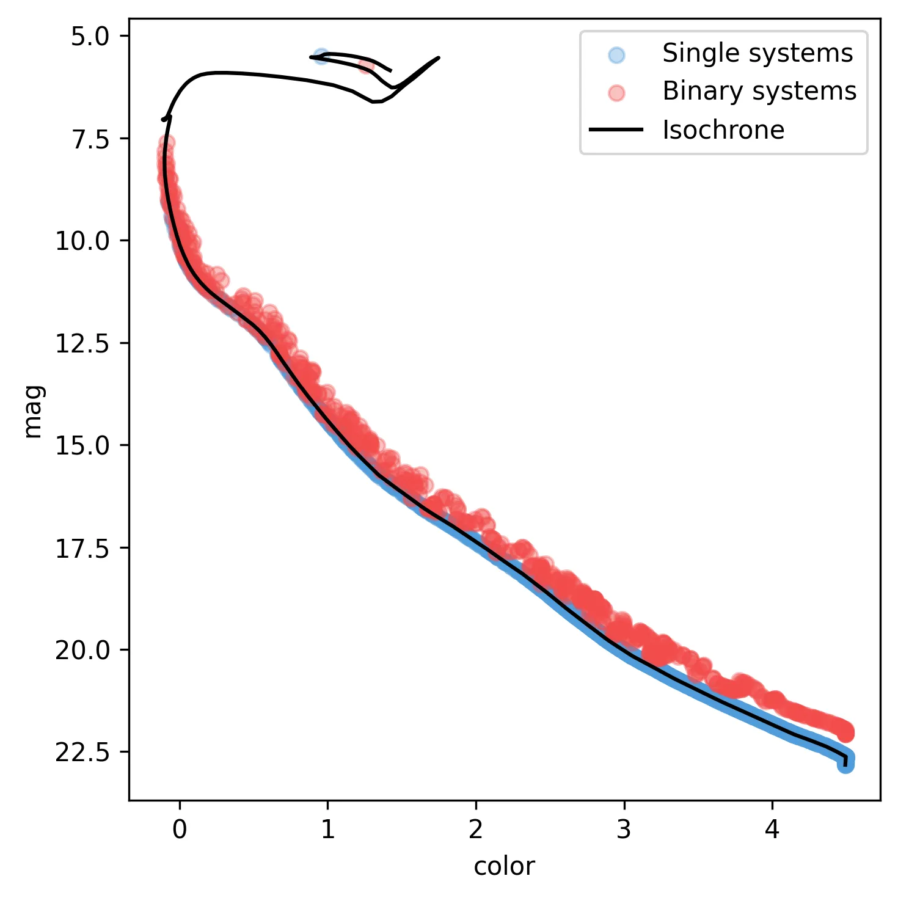
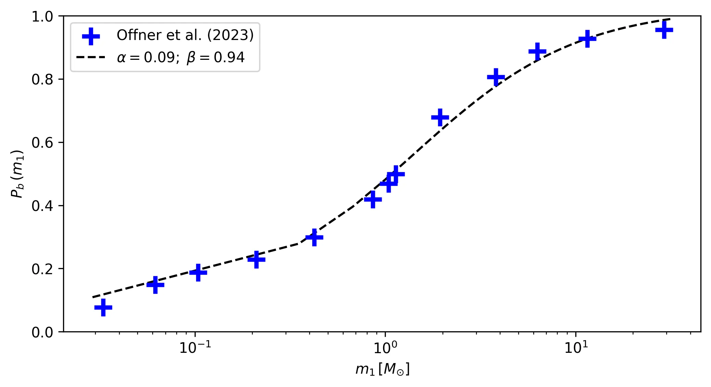
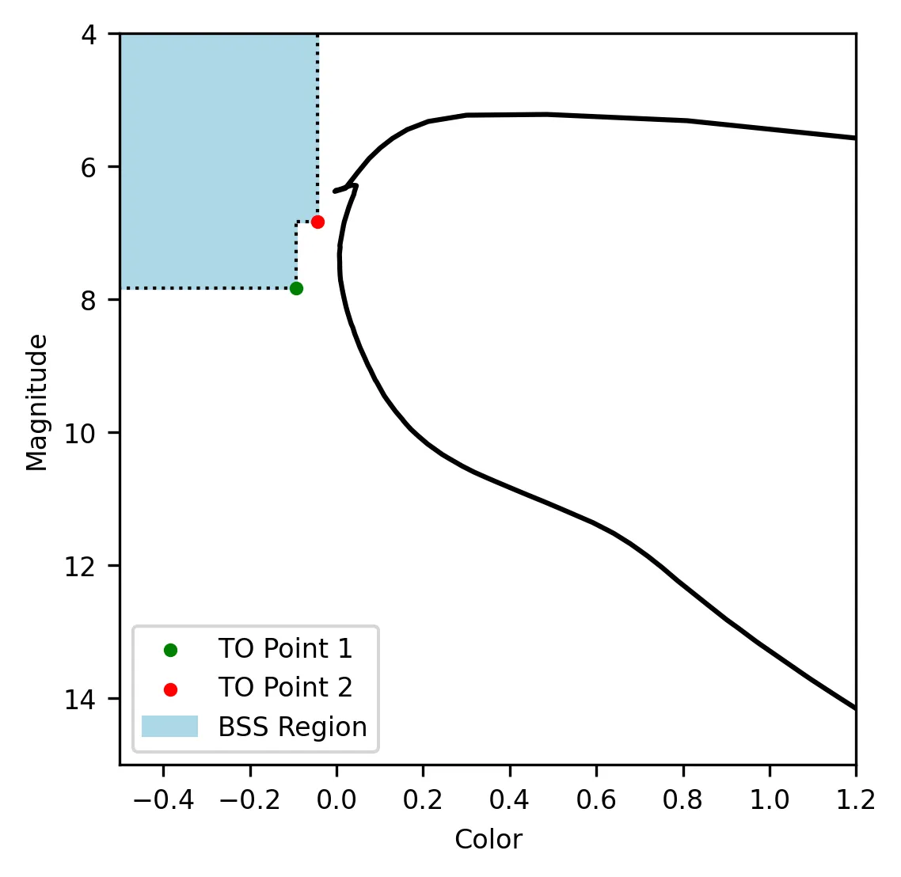

.. _synthetic_module:

Synthetic module
################

The :py:class:`asteca.Synthetic` class allows generating synthetic clusters from:

1. A :py:class:`asteca.Isochrones` object
2. A dictionary of fundamental parameters
3. A :py:class:`asteca.Cluster` object (optional, used for calibration)

The handling of a :class:`synthetic` object is explained in detail in the sub-sections
that follow.

.. _ref_defining:

Defining the object
*******************

To instantiate a :py:class:`asteca.Synthetic` object you need to pass the
:obj:`isochs` object previously generated, as explained in the
:ref:`isochrones_module` section.

.. code-block:: python

    # Synthetic clusters object
    synthcl = asteca.Synthetic(isochs)

This will load the theoretical isochrones and perform the required initial processing
to define a :obj:`synthcl` object. The processing involves sampling an `initial
mass function`_ (IMF) up to a total maximum mass, setting the distributions for the
binary systems' mass ratio, defining the extinction law, and selecting the differential
reddening model.

The basic example above uses the default values for these processes, but
they can be modified by the user at this stage via their arguments. These arguments
are (also see :py:class:`asteca.Synthetic`):

.. code-block:: console

    IMF_name         : Initial mass function
    max_mass         : Maximum total initial mass
    gamma            : Distribution for the mass ratio of the binary systems
    ext_law          : Extinction law
    DR_distribution  : Distribution for the differential reddening

These are explained in more detail in the following sub-sections.

Initial mass function
=====================

The ``IMF_name`` and ``max_mass`` arguments are used to generate random mass samples from
an IMF. To improve the performance of the code, this step is performed when the
:py:class:`asteca.Synthetic` object is created instead of every time a new synthetic
cluster is generated. The ``IMF_name`` argument must be one of those available in
:py:class:`asteca.Synthetic`, associated to IMFs defined in `Salpeter (1995)`_,
`Kroupa (2001)`_, and `Chabrier et al. (2014)`_ (the default value). These are
shown in the figure below:

The ``max_mass`` argument fixes the total mass value to be sampled from the IMF (hence,
it also controls the total number of synthetic stars). This
value should be large enough to allow generating as many synthetic stars as those
present in the observed cluster. The default value is :math:`10000\;M_{\odot}` which
should be more than enough for the majority of clusters.

Binary systems
==============

The ``gamma`` argument (:math:`\gamma`) defines the distribution of the mass ratio for
the binary systems. The mass ratio is the ratio of secondary masses (:math:`m_2`)
to primary masses (:math:`m_1`) in binary systems, written as
:math:`q=m_2/m_1\,(<=1)`. As with the IMF, the :math:`q` distribution is fixed, not
fitted, to improve the performance.

We use ``gamma`` as an argument because the :math:`q` distribution is usually defined
as a power-law, where ``gamma`` or :math:`\gamma` is the exponent or power:

.. math::

    f(q) \approx q^{\gamma(m_1)}

Here, :math:`f(q)` is the distribution of :math:`q` (the mass-ratio) where 
:math:`\gamma(m_1)` means that the value of :math:`\gamma` depends on the primary mass
of the system (this dependence is only true for the `Duchene & Kraus (2013)`_
distribution, see below).

The default selection is ``gamma=D&K``, with ``D&K`` meaning the primary mass-dependent
distribution by `Duchene & Kraus (2013)`_ (see their Table 1 and Figure 3). The user
can also select between the two distributions by `Fisher et al. (2005)`_ (stepped
and peaked, see their Table 3) and `Raghavan et al. (2010)`_ (see their Fig 16,
left). In practice they all look somewhat similar, as shown in the figure below for a
random IMF mass sampling.

The Fisher distributions (top row) favor :math:`q` values closer to unity (i.e.:
secondary masses that are similar to the primary masses), while the Raghavan and
Duchene & Kraus distributions (bottom row) look a bit more uniform.

The user can also select a float value for ``gamma``, which will be used as an
exponent in the power-law function :math:`f(q) \approx q^{\gamma}`. The figure below
shows this distribution for three ``gamma`` (:math:`\gamma`) values, where ``gamma=0``
means a uniform distribution.

Only the Duchene & Kraus distribution is primary-mass dependent. The Fisher and Raghavan
distributions, as well as the distributions set by the user via a float value for
``gamma``, are independent of mass values.

.. _extinction_law:

Extinction law
==============

An extinction law is required to transform the extinction of the photometric system
used for the observed data (the same system used for the isochrones), into the standard
total visual absorption parameter :math:`A_V`. This is defined by the
``ext_law`` argument as one of either ``CCMO`` or ``GAIADR3``.
The first one (``CCMO``) corresponds to the model by
`Cardelli, Clayton & Mathis (1989)`_, with updated coefficients for near-UV from
`O'Donnell (1994)`_. The second one (``GAIADR3``) is `Gaia's (E)DR3`_, color-dependent
law (main sequence), only applicable to Gaia's photometry. If this law is selected,
**ASteCA** assumes that the magnitude and first color used are Gaia's
:math:`G` and :math:`BP-RP` respectively.

While the ``CCMO`` law requires defining the effective lambdas for each filter
in the photometric system when defining the :py:class:`asteca.Isochrones` object
(see :ref:`isochrones_module`), the ``GAIADR3`` law does not require this data
as the extinction coefficients are already defined for Gaia's photometry.

.. important::

    While ``CCMO`` allows different ratio of total to selective extinction :math:`R_V`
    values (which means this parameter can even be fitted), ``GAIADR3`` is to
    be used with :math:`R_V=3.1`. Please read the online documentation and its
    accompanying articles  to learn more about this law's limitations.

The figure below shows a comparison of the extinction laws implemented in **ASteCA**.
Left panel: the ``CCMO`` law showing the normalized extinction curve
:math:`A(\lambda)/A_V` as a function of inverse wavelength for different values of 
:math:`R_V`.
Right panel: ``GAIADR3`` color-dependent extinction law for main-sequence stars,
applicable only to Gaia mission photometry, showing the variation of :math:`A_G/A_V`
with intrinsic :math:`BP-RP` color for different extinction values.

There are dedicated packages like `dustapprox`_, `dust_extinction`_ or `extinction`_
that can handle the extinction coefficients generation. We employ our own
implementation of the ``CCMO`` law adapted from an `IDL Astronomy User's Library`_
script, to increase the performance. If you want to use a different extinction model,
please drop me an `email <mailto:gabrielperren@gmail.com>`_.

To load the :py:class:`asteca.Synthetic` object with the ``GAIADR3`` extinction
law, simply select it when instantiating the object, as follows:

.. code-block:: python

    # Synthetic clusters object
    synthcl = asteca.Synthetic(isochs, ext_law=GAIADR3)

Differential reddening
======================

The ``DR_distribution`` argument fixes the distribution used for the differential
reddening (assuming :math:`DR>0`, see Section
:ref:`ref_generating`). The ``DR_distribution`` argument accepts one of two
string values: ``uniform`` (the default) or ``normal``. These add a random amount to the
total extinction parameter :math:`A_V`, sampled from either a `uniform`_ or a `normal`_
distribution (enforcing a non-negative result). The resulting reddening can be
expressed as:

.. math::

   A_{V,\mathrm{DR}} = \max(0, X)

where, in the ``uniform`` case:

.. math::

   X \sim \mathcal{U}(A_V - DR,\; A_V + DR)

and in the ``normal`` case:

.. math::

   X \sim \mathcal{N}(A_V,\; DR)

The ``uniform`` model produces bounded, symmetric fluctuations with limited dispersion,
while the ``normal`` model yields unbounded fluctuations with heavier tails, leading to
more frequent clipping at zero and a positively skewed distribution.

The following figure shows an example of both distributions for a total extinction
value of :math:`A_V=0.5` and a differential reddening of :math:`DR=1.0`:

.. _initial mass function: https://en.wikipedia.org/wiki/Initial_mass_function
.. _Cardelli, Clayton & Mathis (1989): https://ui.adsabs.harvard.edu/abs/1989ApJ...345..245C
.. _O'Donnell (1994): https://ui.adsabs.harvard.edu/abs/1994ApJ...422..158O
.. _Gaia's (E)DR3: https://www.cosmos.esa.int/web/gaia/edr3-extinction-law
.. _dustapprox: https://mfouesneau.github.io/dustapprox/
.. _dust_extinction: https://dust-extinction.readthedocs.io/
.. _extinction: https://extinction.readthedocs.io/en/latest/
.. _IDL Astronomy User's Library: https://github.com/wlandsman/IDLAstro
.. _uniform: https://numpy.org/doc/stable/reference/random/generated/numpy.random.uniform.html
.. _normal: https://numpy.org/doc/stable/reference/random/generated/numpy.random.normal.html
.. _Salpeter (1995): https://ui.adsabs.harvard.edu/abs/1955ApJ...121..161S
.. _Kroupa (2001): https://ui.adsabs.harvard.edu/abs/2001MNRAS.322..231K/
.. _Chabrier et al. (2014): https://ui.adsabs.harvard.edu/abs/2014ApJ...796...75C
.. _Duchene & Kraus (2013): https://doi.org/10.1146/annurev-astro-081710-102602
.. _Fisher et al. (2005): https://doi.org/10.1111/j.1365-2966.2005.09193.x
.. _Raghavan et al. (2010): https://doi.org/10.1088/0067-0049/190/1/1

.. _ref_calibrating:

Calibrating
***********

The calibration process is applied after instantiating a :class:`asteca.Synthetic`
object, named here :obj:`synthcl` as described in the previous section. This process
is aimed at collecting data from an observed cluster loaded in
a :py:class:`asteca.Cluster` object (which we name here :obj:`my_cluster`, see
:ref:`cluster_module`).

The calibration is performed via the :py:meth:`asteca.Synthetic.calibrate` method:

.. code-block:: python

    # Synthetic cluster calibration
    synthcl.calibrate(my_cluster)

This will extract the following information from the observed cluster:

- Maximum observed photometric magnitude
- Number of observed stars
- Distribution of photometric uncertainties

The algorithm employed by **ASteCA** is to simply transport the observed uncertainty
values in magnitude and color(s) to the generated synthetic stars. This way no
approximation to the distribution of photometric uncertainties is required.

This process is optional. The user can generate synthetic clusters
via the :py:meth:`asteca.Synthetic.generate` method (see :ref:`ref_generating`)
without calibrating the :obj:`synthcl` object. In this case, the synthetic
clusters will be generated with a given number of observed stars (default value is
100 but the user can select any other value), the maximum photometric magnitude
allowed by the loaded isochrones, and no photometric uncertainties added.

The following section explains this process in more detail.

.. _ref_generating:

Generating
**********

To generate synthetic clusters the user is required to pass a dictionary with
fundamental parameters to the :py:meth:`asteca.Synthetic.generate` method.
**ASteCA** currently requires eight parameters, related to the following intrinsic and
extrinsic cluster characteristics:

- *Extrinsic*: distance modulus (``dm``) and extinction related parameters (total
  extinction ``Av``, differential reddening ``DR``, ratio of total to selective
  extinction ``Rv``)
- *Intrinsic*: metallicity (``met``), age (``loga``), and binarity (``alpha, beta``)

These eight parameters are described in more depth in the following sub-sections.
**ASteCA** also allows estimating a cluster's total mass as well as the member stars'
masses and binary and blue straggler probabilities. This process is optional and
requires fitted fundamental parameters and their STDDEVS; see
:ref:`post_process_parameters` for more details.

An example of the dictionary of parameters used for the generation of a synthetic
cluster is shown below, fed to a previously defined :obj:`synthcl` object:

.. code-block:: python

    # Synthetic cluster calibration
    params = {
        "met": 0.0152,
        "loga": 8.0,
        "alpha": 0.0,
        "beta": 1.0,
        "Rv": 3.1,
        "DR": 0.0,
        "Av": 0.1,
        "dm": 8,
    }
    # Generate synthetic cluster.
    synth_clust = synthcl.generate(params, N_stars=2000)

which produces a synthetic CMD similar to the one shown below. Since the 
:obj:`synthcl` object was not calibrated against ans observed cluster, no photometric
uncertainties have been added, and the maximum observed magnitude is the maximum allowed
by the loaded isochrones (the dispersion for the binary systems shown as red points is
expected):

The returned ``synth_clust`` variable holds a ``numpy`` array with the synthetic
cluster data. The notebook :ref:`synth_ntbk` contains more information and examples
on how to generate and process synthetic clusters with **ASteCA**.

.. important::

    The :py:class:`asteca.Synthetic` class includes a ``def_params`` argument with
    a dictionary of default values for all the fundamental parameters. This means
    that the user could call ``synthcl.generate()`` with no ``params`` dictionary,
    and the method will still generate a synthetic cluster. This also allows the
    user to pass a ``params`` dictionary with only a few parameters
    (e.g.: ``params={"met": 0.02, "dm": 12.7}``), and the remaining parameters will
    inherit the default values. More details in :ref:`synth_ntbk`.

Extrinsic parameters
====================

The four extrinsic parameters are related to two external processes affecting stellar
clusters: their distance and the extinction associated with their line of sight. The
distance is quantified through the distance modulus (``dm``), defined as the difference
between the apparent and absolute magnitudes, which determines the shift applied to the
cluster photometry to place the cluster at its proper distance from us.

The three remaining parameters are linked to the extinction process: the total
extinction ``Av``, the ratio of total to selective extinction ``Rv``, and the
differential reddening ``DR``. The first two are related through the equation:

.. math::

    A_V = R_V \times E_{B-V}

Finally, the differential reddening parameter ``DR`` adds random scatter to the cluster
stars affected by ``Av``. The distribution for this scatter is controlled setting the
argument ``DR_distribution`` when the :py:class:`asteca.Synthetic` object is
instantiated (as explained in :ref:`ref_defining`), which can currently be either a
uniform or a normal distribution.

.. _intrinsic_parameters:

Intrinsic parameters
====================

The four intrinsic parameters used to generate a stellar cluster are: metallicity, age,
and total fraction of binary systems (controlled by two parameters).

The metallicity, ``met``, can be modeled either as ``z`` or (logarithmic) ``FeH`` as
explained in the  section :ref:`isochrones_module`. The age parameter, ``loga``, is
modeled as the logarithmic age. The valid ranges for the metallicity and the logarithmic
age are inherited from the theoretical isochrone(s) loaded in the
:py:class:`asteca.Isochrones` object.

The fraction of binary systems in a synthetic cluster is determined by the
``alpha, beta`` parameters through the equation:

.. math::

    P_b(m_1) = \alpha + \beta \times \frac{m_1}{(1.4+m_1)}

where :math:`P_b(m_1)` is the probability that a star of (primary) mass :math:`m_1` is
part of a binary system. This equation comes from a fit to the multiplicity fraction
presented in `Offner et al. (2023)`_ (see their Fig. 1 and Table 1). The multiplicity
fraction values in this work are primary mass dependent, meaning that larger masses
have much larger probabilities of being part of a binary (or higher order) system than
low mass stars.

The values ``alpha=0.09, beta=0.94`` produce a very reasonable fit to this multiplicity
fraction distribution:

These are thus suggested as fixed values for the ``alpha, beta`` parameters. The user
can of course choose to fit either or both of them, or fix them to different values. For
example, fixing ``alpha=0.5, beta=0.0`` would produce a synthetic cluster with
approximately 50% of binary systems, distributed uniformly across masses 
(i.e.: not primary mass dependent).

.. _Offner et al. (2023): https://ui.adsabs.harvard.edu/abs/2023ASPC..534..275O

.. _post_process_parameters:

Post-process parameters
***********************

**ASteCA** is able to estimate extra cluster and stellar parameters, assuming that
proper fundamental parameters have been obtained for the observed cluster.
For these analyses the first step is to call the
:py:meth:`asteca.Synthetic.calibrate()` and
:py:meth:`asteca.Synthetic.get_models()` methods. 

The :py:meth:`asteca.Synthetic.calibrate()` method is explained in
:ref:`ref_calibrating`, it is aimed at extracting information from the observed cluster
to generate synthetic clusters such that they are as similar as possible to the observed
cluster.

The :py:meth:`asteca.Synthetic.get_models()` method requires two input arguments:
a ``model`` dictionary, which is a dictionary of fundamental parameters assigned to
the observed cluster (however obtained), and a ``model_std`` dictionary, which contains
the uncertainties (standard deviations) associated to each parameter in ``model``. 
This method will store in the :class:`asteca.Synthetic` object a number of synthetic
clusters, sampled from a normal distribution centered on the ``model`` values with
STDDEVs taken from the ``model_std`` values.

After calling these methods, we are ready to estimate:

1. The initial, actual, and lost masses associated to the cluster
2. The per-star masses (for both single and binary systems)
3. The per-star probability of being part of a binary system
4. The per-star probability of being a blue straggler (BSS)

From the per-star binary probabilities we can estimate the total binary fraction of the
cluster, and from the per-star blue straggler probabilities we can estimate the total
number of BSSs in the cluster.

The :ref:`post_process_ntbk` tutorial contains examples on how to perform these analyses.
The following sub-sections explain in more detail the methods used to estimate these parameters.

.. _cluster_mass:

Cluster mass
============

**ASteCA** is able to estimate different masses for an observed cluster. The total
initial mass of a cluster :math:`M_{i}` can be split in several parts, as follows:

.. math::
    :label: eq_Mi1

    M_{i} = M_{a} + \Delta M_{evol}(t) + \Delta M_{dyn}(t)

where :math:`M_{a}` is the actual mass, and  :math:`\Delta M_{evol}(t)` & 
:math:`\Delta M_{dyn}(t)` are the fractions of mass **lost** via stellar evolution and
dynamical effects (or *dissolution*), respectively. The actual mass :math:`M_{a}` can be
further split as:

.. math::

    M_{a} = M_{obs} + M_{phot}

where :math:`M_{obs}` is the observed mass and :math:`M_{phot}` is the mass unobserved
due to photometric effects (i.e: the low mass stars beyond the maximum observed
magnitude). The observed mass :math:`M_{obs}` is the sum of individual stellar masses
in the observed CMD:

.. math::

    M_{obs} = \sum_{i}^{N} m_i

where :math:`N` is the total number of observed stars which also includes the identified
stellar binary masses.

The photometric mass :math:`M_{phot}` is inferred
by summing the mass that exists below the mass value associated to the maximum observed
magnitude in the cluster. This requires sampling an IMF with a large mass and
obtaining the ratio of the total mass :math:`M_{phot,s}` to the mass of the
stars brighter than the maximum observed magnitude :math:`M_{obs,s}`.
This ratio is then applied to the observed mass :math:`M_{obs}` to estimate :math:`M_{phot}`.

.. math::

    M_{phot} = \frac{M_{phot,s}}{M_{obs,s}} \times M_{obs}

Following `Lamers et al. (2005)
<https://www.aanda.org/articles/aa/abs/2005/37/aa2241-04/aa2241-04.html>`_ Eq. 7,
the initial mass can be estimated via:

.. math::
    :label: eq_Mi2

    M_i \simeq \left\{ M_a^{\gamma} + \frac{\gamma t}{t_0} \right\}^{1/\gamma} \mu_{\text
    {evol}}(Z, t)^{-1}

where :math:`M_{a}` is the actual mass, :math:`t` is the cluster's age,
:math:`\mu_{\text{evol}}(Z, t)` is the "*fraction of the initial mass of the cluster that
would have remained at age t, if stellar evolution would have been the only mass
loss mechanism*", :math:`{\gamma}` is a constant, and :math:`t_{0}` is "*a constant that
depends on the tidal field of the particular galaxy in which the cluster moves and on
the ellipticity of its orbit*".

The :math:`\gamma` constant is usually set to 0.62 (`Boutloukos & Lamers 2003
<https://academic.oup.com/mnras/article/338/3/717/1458721>`_) and the
:math:`\mu_{\text{evol}}(Z, t)` parameter can be estimated using a 3rd degree polynomial
as shown in 
`Lamers, Baumgardt & Gieles (2010) <http://adsabs.harvard.edu/abs/2010MNRAS.409..305L>`_,
Table B2.

The dissolution parameter :math:`t_0` of a cluster is the hypothetical dissolution
time-scale of a cluster of 1 :math:`M_{\odot}` and is related to the disruption time
:math:`t_{dis}` (defined as the time when 5% of the initial number of stars remain in
the cluster; `Baumgardt & Makino 2003 <https://academic.oup.com/mnras/article/340/1/227/1126410>`_) via:

.. math::

    t_{dis} = t_{0} M_i^{\gamma}

Furthermore, :math:`t_0` is expected to depend on the ambient density
:math:`\rho_{amb}` at the location of the clusters in the Galaxy as:

.. math::

    t_{0} = C_{env} (1-\epsilon) 10^{-4\gamma} \rho_{amb}^{-1/2}

where :math:`C_{env}` is a constant set to 810 Myr (`Lamers, Gieles & Portegies Zwart 2005
<https://www.aanda.org/articles/aa/abs/2005/01/aa1476/aa1476.html>`_),
:math:`\epsilon` is the eccentricity of the orbit, and :math:`\rho_{amb}` is the ambient
density which depends on the adopted gravitational potential field.

Following `Angelo et al. (2023)
<https://ui.adsabs.harvard.edu/abs/2023MNRAS.522..956A/abstract>`_, **ASteCA** uses by
default :math:`\epsilon=0.08` and estimates :math:`\rho_{amb}` as:

.. math::

    \rho_{\text{amb}} = \frac{1}{4\pi G} \nabla^2 \left[ \phi_B(r) + \phi_D(\rho, z) + \phi_H(r) \right]

where :math:`\phi_B(r),\, \phi_D(\rho, z),\, \phi_H(r)` are the bulge, disc and halo
potentials, respectively (see Eqs 8, 9 and 10 of the Angelo et al. article to see how
these are modeled). The user can also use a custom :math:`\rho_{\text{amb}}` value,
bypassing this estimation.

Plugging these values into Eq :eq:`eq_Mi2`, we can obtain an estimate of :math:`M_{i}`.
With this value we can then obtain :math:`M_{evol}` through the
:math:`\mu_{\text{evol}}(Z, t)` parameter as:

.. math::

    \Delta M_{evol}(t) = M_{i}  \times [1 - \mu_{\text{evol}}(Z, t)]

Finally, the last remaining mass is the dynamical mass (mass lost via dynamical
effects) which we estimate simply using Eq :eq:`eq_Mi1` as:

.. math::

    \Delta M_{dyn}(t) = M_{i} - M_{a} - \Delta M_{evol}(t)

The distributions for these masses are obtained through a bootstrap process that
takes the uncertainties in the fundamental parameters into account.

.. _stellar_parameters:

Stellar parameters
==================

**ASteCA** provides a simple method to assign, for each member star of your observed
cluster, its individual masses and probabilities of belonging to a binary system
and/or of being a blue straggler star (BSS). The method is called
:py:meth:`asteca.Synthetic.stellar_parameters`, and it applies the following algorithm:

1. Starting from an observed cluster
2. Generate a synthetic cluster with some fundamental parameters
3. Select a given star from the observed cluster
4. Find the closest synthetic star (in photometric space) to this observed star
5. Extract from that synthetic star its primary and secondary mass values (see
   :ref:`stellar_masses`)
6. Classify as a binary system if the synthetic star is a binary system (see
   :ref:`binary_fraction`)
7. Classify as a BSS if the observed star is located inside the BSS region of the CMD
   (see :ref:`bss_total_number`)
8. Repeat for all stars in the observed cluster
9. Repeat for ``N_models`` synthetic clusters (obtained previously via the
   :py:meth:`asteca.Synthetic.get_models` method)

.. important::

    If no binary systems were generated for the synthetic clusters, i.e.: if
    ``alpha=0, beta=0``, then *all* the ``N_models`` secondary masses
    assigned to *all* the observed stars will be ``NaN`` values.

At the end of this process each observed star will have ``N_models`` (synthetic)
primary and secondary masses assigned, as well as ``N_models`` classifications as
single or binary systems, and as BSS or non-BSS. Dividing these values by ``N_models``
we can obtain the median and STDDEV of the primary and secondary masses
(``m1, m1_std, m2, m2_std``), as well as the binary (``binar_prob``) and BSS
(``bss_prob``) probabilities for each observed star. This information is returned in a
dictionary, e.g.:

.. code-block:: python

    m1          m1_std      m2          m2_std      binar_prob  bss_prob
    2.097448    0.069362    0.943936    0.428501    0.955       0.00
    2.448664    0.069279    0.899969    0.505402    0.880       0.00
    1.144592    0.033893    0.792089    0.148655    1.000       0.00
    5.128257    0.006436    0.332486    1.866812    1.000       0.00
    2.013352    0.047131    0.617952    0.402121    0.925       0.00
    ...         ...         ...         ...         ...         ...
    4.903612    0.066992    1.077981    1.053122    0.935       0.58
    5.004987    0.027138    0.136899    1.547418    1.000       1.00
    4.903612    0.071683    1.077981    1.111556    0.935       1.00
    5.004987    0.027138    0.136899    1.547418    1.000       1.00
    5.267652    0.107628    1.115867    1.133406    0.990       1.00

The sub-sections that follow explain in more detail how the stellar masses are
estimated, as well as how the binary and BSS probabilities can be used to estimate
the total binary fraction and the total number of BSSs in the cluster.

See the :ref:`post_process_ntbk` tutorial for a full example on how this analysis is
performed for an observed cluster.

.. _stellar_masses:

Stellar masses
--------------

For a given observed star ``i`` the :py:meth:`asteca.Synthetic.stellar_parameters`
method will assign two arrays of masses of ``N_models`` length each:

.. code-block:: python

    observed_star_i = {
        m1_array: [0.5, 1.01, 0.32, ...],  # N_models estimates for the primary mass
        m2_array: [0.15, 0.69, NaN, ...],  # N_models estimates for the secondary mass
    }

where ``m1_array`` contains the primary mass values of the closest synthetic stars to
``observed_star_i`` in each of the ``N_models`` synthetic clusters, and ``m2_array``
contains the secondary mass values of those same synthetic stars. If a given closest
synthetic star is a single system, then the secondary mass value assigned to
``observed_star_i`` will be ``NaN``.

By taking the median and the STDDEV of these two arrays, we obtain an estimate of the
primary and secondary masses (called ``m1`` and ``m2`` respectively), as well as their
uncertainties (``m1_std`` and ``m2_std``), for each observed star, i.e.:

.. code-block:: python

    observed_star_i = {
        m1: 0.73,  m1_std: 0.09,
        m2: 0.32,  m2_std: 0.01,
    }

.. note::

   All observed stars will have a primary and a secondary mass assigned after this
   process, the secondary mass can be a ``NaN`` value. This does not mean that all
   observed stars are binary systems. The user has to decide which observed stars are
   binary systems and which ones are single systems. This is explained below.

For observed stars associated to single systems, only the primary mass (``m1``) makes
sense. On the other hand, for those observed stars better described as binary systems
(i.e: those with ``binar_prob>0.5``), the secondary mass value estimated above
(``m2``) can be used to describe the total mass of the "`observed binary system`" as
``m_tot = m1+m2``.

For example, if ``observed_star_i`` has ``binar_prob=0.95`` we can decide that it is
a binary system. Hence the primary and secondary mass values are valid and we can
use them to describe the observed binary system as:

.. code-block:: python

    observed_binary_star_i = {
        m1: 0.73,  m1_std: 0.09,
        m2: 0.32,  m2_std: 0.01,
    }

for a total mass of the binary system of ``m_tot = m1 + m2 = 1.05``.

If, on the other hand, ``observed_star_i`` has ``binar_prob=0.25`` we can decide that
it is a single system. Hence the secondary mass value is of no interest and we can
ignore it. The observed star will then be described as:

.. code-block:: python

    observed_single_star_i = {
        m1: 0.73,  m1_std: 0.09,
    }

.. _binary_fraction:

Binary fraction
---------------

The generation of synthetic binary systems is handled through the
``alpha, beta`` parameters as explained in :ref:`intrinsic_parameters`.
The ``alpha, beta`` parameters can be fixed to given values (e.g.:
``alpha=0.09, beta=0.94`` to mimic the Offner et al. (2023) multiplicity fraction
distribution), or they can be fitted, to obtain values that more closely matches the
observed cluster's binary system distribution.

There is thus no *total binary fraction* parameter used when generating synthetic
clusters. This parameter can be estimated via the binary system probabilities obtained
by the :py:meth:`asteca.Synthetic.stellar_parameters` method.
The :ref:`post_process_ntbk` tutorial shows how the median and standard deviation of the
total cluster binary fraction for an observed cluster can be computed from these
probabilities.

.. _bss_total_number:

Blue stragglers
---------------

The BSS region of the CMD is defined as the region above the cluster's turn-off
point and bluer than the main sequence. In **ASteCA** this region is
defined as the region towards lower values of two points:

.. code-block:: python

    # The two points that define the BSS regions are defined as:
    to_point_1 = [to_col + col_offset_1, to_mag + mag_offset_1]
    to_point_2 = [to_col + col_offset_2, to_mag + mag_offset_2]

where the turn-off point ``(to_col, to_mag)`` is estimated by ASteCA given the
best fit isochrone. The default BSS region looks like this:

The two-point polygon allows separating the BSS region from lower mass
stars in the main sequence (the TP point 1 is defined at a smaller color value
than TO point 2). These stars can be affected by photometric uncertainties that
make them look bluer than they actually are, thus mimicking the BSS region.

The values for the offsets ``(col_offset_1, mag_offset_1, col_offset_2, mag_offset_2)``
can be modified by the user via the arguments of the
:py:meth:`asteca.Synthetic.stellar_parameters` method.

.. important::

    The current implementation assigns masses and binary probabilities to all
    observed stars, including those identified as probable BSSs. **These values are
    not expected to be accurate**, since the BSSs follow a younger isochrone than that
    used for the remaining cluster stars.
    The user should ignore these values until a proper implementation to handle BSSs
    masses and binary probabilities is implemented.

The blue straggler probability assigned to each observed star can be easily
used to obtain the total number of probable BSSs in the cluster. See the
:ref:`post_process_ntbk` tutorial for an example of how this is done.
