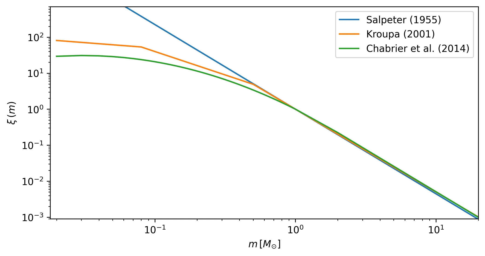

.. _synthetic_module:

Synthetic module
################

The :py:class:`asteca.Synthetic` class allows generating synthetic clusters from:

1. A :py:class:`asteca.Isochrones` object
2. A dictionary of fundamental parameters
3. A :py:class:`asteca.Cluster` object (optional, used for calibration)

The handling of a :class:`synthetic` object is explained in detail in the sub-sections
that follow.

.. _ref_defining:

Defining the object
*******************

To instantiate a :class:`synthetic` object you need to pass the :class:`isochs`
object previously generated, as explained in the section :ref:`isochrones_module`.

.. code-block:: python

    # Synthetic clusters object
    synthcl = asteca.Synthetic(isochs)

This will perform the required initial processing and load the theoretical isochrones
into the :class:`synthcl` object. The processing involves sampling an `initial
mass function`_ (IMF), setting the distributions for the binary systems' mass ratio,
and the differential reddening (these two last processes are optional).

The basic example above uses the default values for these three processes, but
they can be modified by the user at this stage via their arguments. These arguments
are (also see :py:class:`asteca.Synthetic`):

.. code-block:: console

    ext_law          : Extinction law
    DR_distribution  : Distribution for the differential reddening
    IMF_name         : Initial mass function
    max_mass         : Maximum total initial mass
    gamma            : Distribution for the mass ratio of the binary systems

The ``ext_law`` argument defines the extinction law as one of either ``CCMO`` or
``GAIADR3``. The first one corresponds to the model by
`Cardelli, Clayton & Mathis (1989)`_, with updated coefficients for near-UV from
`O'Donnell (1994)`_. The second one is `Gaia's (E)DR3`_, color-dependent law (main
sequence), only applicable to Gaia's photometry. If this law is selected, **ASteCA**
assumes that the magnitude and first color used are Gaia's ``G`` and ``BP-RP``
respectively. 

.. important::

    While ``CCMO`` allows different ``Rv`` values (which means this parameter can even
    be fitted), ``GAIADR3`` is to be used with ``Rv=3.1``. Please read the online
    documentation and its accompanying articles  to learn more about this law's
    limitations.

There are dedicated packages like `dustapprox`_, `dust_extinction`_ or `extinction`_
that can handle this process. We chose to employ our own implementation to increase the
performance. If you want to use a different extinction model, please drop me an
`email <mailto:gabrielperren@gmail.com>`_.

The ``DR_distribution`` argument fixes the distribution used for the differential
reddening (assuming that the ``DR`` parameter is different than 0, see Section
:ref:`ref_generating`). The differential reddening effect adds a random amount to the
total extinction parameter ``Av``, sampled from either a `uniform`_ or a `normal`_
distribution. The ``DR_distribution`` argument hence accepts one of two string values:
``uniform`` (the default) or ``normal``.

The ``IMF_name`` and ``max_mass`` arguments are used to generate random mass samples from
an IMF. To improve the performance of the code, this step is performed when the
:py:class:`asteca.Synthetic` object is created instead of every time a new synthetic
cluster is generated. The ``IMF_name`` argument must be one of those available in
:py:class:`asteca.Synthetic`: ``salpeter_1955, kroupa_2001, chabrier_2014``.
Currently these are associated to the following IMFs:

as defined in `Salpeter (1995)`_, `Kroupa (2001)`_, and `Chabrier et al. (2014)`_
(the default value). The ``max_mass`` argument simply fixes the total mass
value to be sampled. This value should be large enough to allow generating as many
synthetic stars as those present in the observed cluster. The default value is
:math:`10000\;M_{\odot}` which should be more than enough for the vast majority of
clusters.

The ``gamma`` argument (:math:`\gamma`) defines the distribution of the mass ratio for
the binary systems. The mass ratio is the ratio of secondary masses (:math:`m_2`)
to primary masses (:math:`m_1`) in binary systems, written as
:math:`q=m_2/m_1\,(<=1)`. As with the IMF, the :math:`q` distribution is fixed, not
fitted, to improve the performance.

We use ``gamma`` as an argument because the :math:`q` distribution is usually defined
as a power-law, where ``gamma`` or :math:`\gamma` is the exponent or power:

.. math::

    f(q) \approx q^{\gamma(m_1)}

Here, :math:`f(q)` is the distribution of :math:`q` (the mass-ratio) where 
:math:`\gamma(m_1)` means that the value of :math:`\gamma` depends on the primary mass
of the system (this dependence is only true for the `Duchene & Kraus (2013)`_
distribution, see below).

The default selection is ``gamma=D&K``, with ``D&K`` meaning the primary mass-dependent
distribution by `Duchene & Kraus (2013)`_ (see their Table 1 and Figure 3). The user
can also select between the two distributions by `Fisher et al. (2005)`_ (stepped
and peaked, see their Table 3) and `Raghavan et al. (2010)`_ (see their Fig 16,
left). In practice they all look somewhat similar, as shown in the figure below for a
random IMF mass sampling.

The Fisher distributions (top row) favor :math:`q` values closer to unity (i.e.:
secondary masses that are similar to the primary masses), while the Raghavan and
Duchene & Kraus distributions (bottom row) look a bit more uniform.

The user can also select a float value for ``gamma``, which will be used as an
exponent in the power-law function :math:`f(q) \approx q^{\gamma}`. The figure below
shows this distribution for three ``gamma`` (:math:`\gamma`) values, where ``gamma=0``
means a uniform distribution.

Only the Duchene & Kraus distribution is primary-mass dependent. The Fisher and Raghavan
distributions, as well as the distributions set by the user via a float value for
``gamma``, are independent of mass values.

.. _initial mass function: https://en.wikipedia.org/wiki/Initial_mass_function
.. _Cardelli, Clayton & Mathis (1989): https://ui.adsabs.harvard.edu/abs/1989ApJ...345..245C
.. _O'Donnell (1994): https://ui.adsabs.harvard.edu/abs/1994ApJ...422..158O
.. _Gaia's (E)DR3: https://www.cosmos.esa.int/web/gaia/edr3-extinction-law
.. _dustapprox: https://mfouesneau.github.io/dustapprox/
.. _dust_extinction: https://dust-extinction.readthedocs.io/
.. _extinction: https://extinction.readthedocs.io/en/latest/
.. _uniform: https://numpy.org/doc/stable/reference/random/generated/numpy.random.uniform.html
.. _normal: https://numpy.org/doc/stable/reference/random/generated/numpy.random.normal.html
.. _Salpeter (1995): https://ui.adsabs.harvard.edu/abs/1955ApJ...121..161S
.. _Kroupa (2001): https://ui.adsabs.harvard.edu/abs/2001MNRAS.322..231K/
.. _Chabrier et al. (2014): https://ui.adsabs.harvard.edu/abs/2014ApJ...796...75C
.. _Duchene & Kraus (2013): https://doi.org/10.1146/annurev-astro-081710-102602
.. _Fisher et al. (2005): https://doi.org/10.1111/j.1365-2966.2005.09193.x
.. _Raghavan et al. (2010): https://doi.org/10.1088/0067-0049/190/1/1

.. _ref_calibrating:

Calibrating
***********

The calibration process is applied after instantiating a :class:`asteca.Synthetic`
object, named here :obj:`synthcl` as described in the previous section. This process
is optional and it is aimed at collecting data from an observed cluster loaded in
a :py:class:`asteca.Cluster` object (which we name here :obj:`my_cluster`, see
:ref:`cluster_module`).

The calibration is performed via the :py:meth:`asteca.Synthetic.calibrate` method:

.. code-block:: python

    # Synthetic cluster calibration
    synthcl.calibrate(my_cluster)

This will extract the following information from the observed cluster:

- maximum observed photometric magnitude
- number of observed stars
- distribution of photometric uncertainties

The algorithm employed by **ASteCA** is to simply transport the observed uncertainty
values in magnitude and color(s) to the generated synthetic stars. This way no
approximation to the distribution of photometric uncertainties is required.

As stated, this process is optional. The user can generate synthetic clusters without
calibrating the :obj:`synthcl` object. In this case, the synthetic clusters will be
generated with a given number of observed stars (default value is 100 but the user can
select any other value), the maximum photometric magnitude allowed by the loaded
isochrones, and no photometric uncertainties added. The following section explains this
process in more detail.

.. _ref_generating:

Generating
**********

To generate synthetic clusters the user is required to pass a dictionary with
fundamental parameters to the :py:meth:`asteca.Synthetic.generate` method.
**ASteCA** currently requires eight parameters, related to the following intrinsic and
extrinsic cluster characteristics:

- *Intrinsic*: metallicity (``met``), age (``loga``), and binarity (``alpha, beta``)
- *Extrinsic*: distance modulus (``dm``) and extinction related parameters (total
  extinction ``Av``, differential reddening ``DR``, ratio of total to selective
  extinction ``Rv``)

These eight parameters are described in more depth in the following sub-sections.
**ASteCA** also allows estimating a cluster's member stars masses and binary
probability, as well as its total mass and binary fraction. This process is optional and
requires dictionaries with fitted fundamental parameters and their STDDEVS; see
:ref:`masses_and_binarity` for more details.

An example of the dictionary of parameters used for the generation of a synthetic
cluster is shown below, applied to a previously defined :obj:`synthcl` object:

.. code-block:: python

    # Define model parameters
    params = {
        "met": 0.01,
        "loga": 9.87,
        "alpha": 0.01,
        "beta": 1.,
        "Rv": 3.1,
        "dm": 11.3,
        "Av": 0.15,
        "DR": 0.2,
    }

    # Generate the synthetic cluster
    synth_clust = synthcl.generate(params)

The returned ``synth_clust`` variable will hold a ``numpy`` array with the synthetic
cluster data. The notebook :ref:`synth_ntbk` contains more information and examples
on how to generate and process synthetic clusters with **ASteCA**.

.. important::

    The :py:class:`asteca.Synthetic` class includes a ``def_params`` argument with
    a dictionary of default values for all the fundamental parameters. This means
    that the user could call ``synthcl.generate()`` with no ``params`` dictionary,
    and the method will still generate a synthetic cluster. This also allows the
    user to pass a ``params`` dictionary with only a few parameters
    (e.g.: ``params={"met": 0.02, "dm": 12.7}``), and the remaining parameters will
    inherit the default values. More details in :ref:`synth_ntbk`.

.. _intrinsic_parameters:

Intrinsic parameters
====================

The valid ranges for the metallicity and logarithmic age are inherited from the
theoretical isochrone(s) loaded in the :py:class:`asteca.Isochrones` object.

The metallicity, ``met``, can be modeled either as ``z`` or (logarithmic) ``FeH`` as
explained in section :ref:`isochrones_module`. The age parameter, ``loga``, is modeled
as the logarithmic age.

The ``alpha, beta`` parameters determine the fraction of binary systems
in a synthetic cluster through the equation:

.. math::

    P_b(m_1) = \alpha + \beta \times \frac{m_1}{(1.4+m_1)}

where :math:`P_b(m_1)` is the probability that a star of (primary) mass :math:`m_1` is
part of a binary system. This equation comes from a fit to the multiplicity fraction
presented in `Offner et al. (2023)`_ (see their Fig. 1 and Table 1). The multiplicity
fraction values in this work are primary mass dependent, meaning that larger masses
have much larger probabilities of being part of a binary (or higher order) system than
low mass stars.

The values ``alpha=0.09, beta=0.94`` produce a very reasonable fit to this multiplicity
fraction distribution:

These are thus suggested as fixed values for the ``alpha, beta`` parameters. The user
can of course choose to fit either or both of them, or fix them to different values. For
example, fixing ``alpha=0.5, beta=0.0`` would produce a synthetic cluster with
approximately 50% of binary systems, distributed uniformly across masses 
(i.e.: not primary mass dependent).

.. _Offner et al. (2023): https://ui.adsabs.harvard.edu/abs/2023ASPC..534..275O

Extrinsic parameters
====================

The extrinsic parameters are related to two external processes affecting stellar
clusters: their distance and the extinction associated to their line of sight. The
distance is measured by the distance modulus ``dm``, which is the amount added to the
photometric magnitude to position the cluster at the proper distance from us. 

The three remaining parameters are linked to the extinction process: the total
extinction ``Av``, the ratio of total to selective extinction ``Rv``, and the
differential reddening ``DR``.

The first two are related through the equation:

.. math::

    A_V = R_V \times E_{B-V}

Finally, the differential reddening parameter ``DR`` adds random scatter to the cluster
stars affected by ``Av``. The distribution for this scatter is controlled setting the
argument ``DR_distribution`` when the :obj:`synthetic` object is instantiated (as
explained in :ref:`ref_defining`), which can currently be either a uniform or a
normal distribution.

.. _masses_and_binarity:

Masses and binarity
*******************

Using methods available in the :py:class:`asteca.Synthetic` class, we can estimate
for an observed cluster:

1. The individual stellar masses and their probability of being binary systems,
   via the :py:meth:`asteca.Synthetic.stellar_masses` method
2. The total binary fraction of the cluster, via the
   :py:meth:`asteca.Synthetic.binary_fraction` method
3. The different total masses associated to the cluster, via the
   :py:meth:`asteca.Synthetic.cluster_masses` method

The user can choose to perform all or only some of them.

For all these analyses the first step is to call the
:py:meth:`asteca.Synthetic.get_models` method. This method requires two arguments:
a ``model`` dictionary, which is a dictionary of parameters to be fitted, and a
``model_std`` dictionary, which contains the uncertainties (standard deviations)
associated to each parameter in ``model``. 

This method will store in the :obj:`synthetic` object a number of generated synthetic 
clusters, sampled from a normal distribution centered on the ``model`` values with
STDDEVs taken from the ``model_std`` values. By default `200` models are generated but
this can be changed via the ``N_models`` argument of the method.

After calling this method, the individual stellar masses and binarity, the cluster total
binarity fraction, and the cluster total masses can be estimated as shown in the
following sub-sections.

The :ref:`masses_bfr_ntbk` tutorial contains examples on how to perform these analyses.

.. _stellar_masses:

Stellar masses
==============

**ASteCA** provides a simple method to assign, for each member star of your observed
cluster, its individual masses and probabilities of belonging to a binary system. The
method is called  :py:meth:`asteca.Synthetic.stellar_masses`, and given a
:obj:`synthetic` object it applies the following algorithm:

1. Starting from an observed cluster
2. Generate a synthetic cluster with some fundamental parameters
3. Select a given star from the observed cluster
4. Find the closest synthetic star (in photometric space) to this observed star
5. Extract from that synthetic star its primary and secondary mass values (if the
   synthetic star is *not* a binary system, the secondary mass value is ``NaN``)
6. Attach both mass values to the observed star
7. Repeat for all stars in the observed cluster
8. Repeat for ``N_models`` synthetic clusters (obtained via the
   :py:meth:`asteca.Synthetic.get_models` method)

At the end of this process each observed star will have ``N_models`` (synthetic) primary
and secondary masses assigned. All primary masses are floats, but *some* secondary
masses can be ``NaN`` values. If no binary systems were generated for the synthetic
clusters (i.e.: if ``alpha=0, beta=0``), then *all* the ``N_models`` secondary masses
assigned to *all* the observed stars will be ``NaN`` values.

For example, observed star ``i`` will have the following two arrays attached to it:

.. code-block:: python

    observed_star_i = {
        m1_array: [0.5, 1.01, 0.32, ...],  # N_models estimates for the primary mass
        m2_array: [0.15, 0.69, NaN, ...],  # N_models estimates for the secondary mass
    }

and so will every other observed star in the cluster.

By taking the median and the STDDEV of these two arrays, we obtain an estimate of the
primary and secondary masses (called ``m1`` and ``m2`` respectively), as well as their
uncertainties (``m1_std`` and ``m2_std``), for each observed star, i.e.:

.. code-block:: python

    observed_star_i = {
        m1: 0.73,  m1_std: 0.09,
        m2: 0.32,  m2_std: 0.01,
    }

.. note::

   All observed stars will have a primary and a secondary mass assigned after this
   process (the secondary mass can be a ``NaN`` value). This does not mean that all
   observed stars are binary systems. The user has to decide which observed stars are binary systems and which ones are single systems. This is explained below.

How do we decide if an observed star is a single or a binary system? By counting the
times each observed star was assigned to a (synthetic) binary system in the algorithm
described above, we can estimate a "`binary probability`" (``binar_prob``) for each
observed star. Given this value, we can simply select a cut for example at ``0.5`` so
that all observed star with ``binar_prob>0.5`` are considered binary systems, and the
rest are single systems.

For observed stars associated to single systems, only the primary mass (``m1``) makes
sense. On the other hand, for those observed stars better described as binary systems
(i.e: those with ``binar_prob>0.5``), the secondary mass value estimated above
(``m2``) can be used to describe the total mass of the "`observed binary system`" as
``m_tot = m1+m2``.

For example, if ``observed_star_i`` has ``binar_prob=0.95`` we can decide that it is
a binary system. Hence the primary and secondary mass values are valid and we can
use them to describe the observed binary system as:

.. code-block:: python

    observed_binary_star_i = {
        m1: 0.73,  m1_std: 0.09,
        m2: 0.32,  m2_std: 0.01,
    }

for a total mass of the binary system of ``m_tot = m1 + m2 = 1.05``.

If, on the other hand, ``observed_star_i`` has ``binar_prob=0.25`` we can decide that
it is a single system. Hence the secondary mass value is of no interest and we can
ignore it. The observed star will then be described as:

.. code-block:: python

    observed_single_star_i = {
        m1: 0.73,  m1_std: 0.09,
    }

See the :ref:`masses_bfr_ntbk` tutorial for a full example on how this analysis is
performed for an observed cluster.

.. _binary_fraction:

Binary fraction
===============

The fraction of generated synthetic binary systems is handled through the
``alpha, beta`` parameters as explained in :ref:`intrinsic_parameters`. There is thus
no proper *binary fraction* parameter used when generating synthetic clusters. This
parameter can be estimated using the :meth:`asteca.Synthetic.binary_fraction` method
on a :obj:`synthetic` object.

The method takes an array of binary probabilities (for example the ``binar_prob``
array obtained in the section above), and calculates the median and STDDEV
binary fraction associated to the observed cluster from where the array came from.

Each probability value in the array is compared several thousand times against a random
value sampled in the ``[0.0, 1.0]`` range. This simulates measurements where each star
is part of a binary system or not, depending on whether its associated binary
probability is larger than the random value. 

By counting the number of observed stars that are identified as binary systems in each
of these thousand samples, we can estimate the distribution of the total binary fraction
of the observed cluster.

Finally, the median and standard deviation of these binary fractions across all samples 
are computed and returned as summary statistics.

This process is much more reasonable than simply counting the number of values in
``binar_prob`` that are beyond a given probability cut (usually ``0.5``), because
it takes into account the *distribution* of binary probabilities for the observed stars.

.. _cluster_mass:

Cluster mass
============

**ASteCA** is able to estimate different masses for an observed cluster, as explained
below.

The total initial mass of a cluster can be split in several parts, as follows:

.. math::
    :label: eq_Mi1

    M_{i} = M_{a} + M_{evol} + M_{dyn}

where :math:`M_{i}` is the initial mass, :math:`M_{a}` is the actual mass,
:math:`M_{evol}` is the mass **lost** via stellar evolution, and :math:`M_{dyn}` is
the mass **lost** through dynamical effects (or *dissolution*). The actual mass
:math:`M_{a}` can be further split as:

.. math::

    M_{a} = M_{obs} + M_{phot}

where :math:`M_{obs}` is the observed mass (e.g.: the sum of individual stellar masses
in the observed CMD) and :math:`M_{phot}` is the mass **unobserved** due to photometric
effects (i.e: the low mass stars beyond the maximum magnitude cut). The total initial
mass can thus be written as the sum of all of its components as:

.. math::

    M_{i} = M_{obs} + M_{phot} + M_{evol} + M_{dyn}

The actual mass :math:`M_{a}` is estimated by **ASteCA** combining the observed and
photometric masses. The observed mass :math:`M_{obs}` is approximated as the sum of the
individual stellar masses of many synthetic clusters, sampled with parameters
matching those of the observed cluster. The photometric mass :math:`M_{phot}` is inferred
by summing the mass that exists below the mass value associated to the maximum observed
magnitude in the cluster. This requires sampling an IMF with a very large mass, and
obtaining the ratio of :math:`M_{obs}` to total mass; this ratio is the applied to the
sum of masses below the mass cut in the IMF to estimate :math:`M_{phot}`.
As stated above, the sum of these two masses is equivalent to :math:`M_{a}`.

Following `Lamers et al. (2005)
<https://www.aanda.org/articles/aa/abs/2005/37/aa2241-04/aa2241-04.html>`_ Eq. 7,
the initial mass can be estimated via:

.. math::
    :label: eq_Mi2

    M_i \simeq \left\{ M_a^{\gamma} + \frac{\gamma t}{t_0} \right\}^{1/\gamma} \mu_{\text
    {evol}}(Z, t)^{-1}

where :math:`M_{a}` is the actual mass, :math:`t` is the cluster's age,
:math:`\mu_{\text{evol}}(Z, t)` is the "*fraction of the initial mass of the cluster that
would have remained at age t, if stellar evolution would have been the only mass
loss mechanism*", :math:`{\gamma}` is a constant, and :math:`t_{0}` is "*a constant that
depends on the tidal field of the particular galaxy in which the cluster moves and on
the ellipticity of its orbit*".

The :math:`\gamma` constant is usually set to 0.62 and the
:math:`\mu_{\text{evol}}(Z, t)` parameter can be estimated using a 3rd degree polynomial
as shown in 
`Lamers, Baumgardt & Gieles (2010) <http://adsabs.harvard.edu/abs/2010MNRAS.409..305L>`_,
Table B2.

The dissolution parameter :math:`t_0` of a cluster is the hypothetical dissolution
time-scale of a cluster of 1 :math:`M_{\odot}` and is related to the disruption time
:math:`t_{dis}` (defined as the time when 5% of the initial number of stars remain in
the cluster) via:

.. math::

    t_{dis} = t_{0} M_i^{\gamma}

Furthermore, :math:`t_0` is expected to depend on the ambient density
:math:`\rho_{amb}` at the location of the clusters in the Galaxy as:

.. math::

    t_{0} = C_{env} (1-\epsilon) 10^{-4\gamma} \rho_{amb}^{-1/2}

where :math:`C_{env}` is a constant set to 810 Myr (`Lamers, Gieles & Zwart 2005
<https://www.aanda.org/articles/aa/abs/2005/01/aa1476/aa1476.html>`_),
:math:`\epsilon` is the eccentricity of the orbit, and :math:`\rho_{amb}` is the ambient
density which depends on the adopted gravitational potential field.

Following `Angelo et al. (2023)
<https://ui.adsabs.harvard.edu/abs/2023MNRAS.522..956A/abstract>`_, **ASteCA** uses by
default :math:`\epsilon=0.08` and estimates :math:`\rho_{amb}` as:

.. math::

    \rho_{\text{amb}} = \frac{1}{4\pi G} \nabla^2 \left[ \phi_B(r) + \phi_D(\rho, z) + \phi_H(r) \right]

where :math:`\phi_B(r),\, \phi_D(\rho, z),\, \phi_H(r)` are the bulge, disc and halo
potentials, respectively (see Eqs 8, 9 and 10 of the Angelo et al. article to see how
these are modeled). The user can also use a custom :math:`\rho_{\text{amb}}` value,
bypassing this estimation.

Plugging these values into Eq :eq:`eq_Mi2`, we can obtain an estimate of :math:`M_{i}`.
With this value we can then obtain :math:`M_{evol}` through the
:math:`\mu_{\text{evol}}(Z, t)` parameter as:

.. math::

    M_{evol} = M_{i}  \times [1 - \mu_{\text{evol}}(Z, t)]

Finally, the last remaining mass is the dynamical mass which we estimate simply
using Eq :eq:`eq_Mi1` as:

.. math::

    M_{dyn} = M_{i} - M_{a} - M_{evol}

The distributions for these masses are obtained through a bootstrap process that
takes the uncertainties in the fundamental parameters into account.

