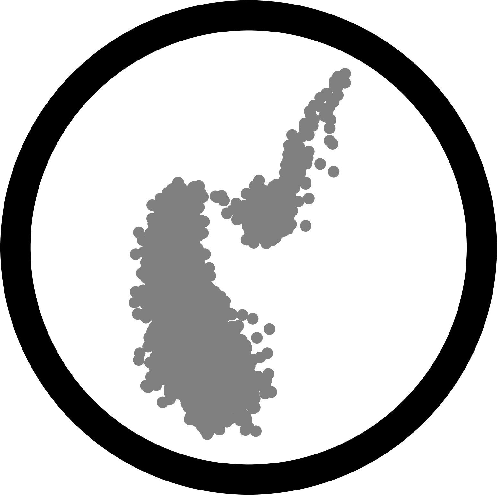

.. ASteCA documentation master file, created by
   sphinx-quickstart on Sat Feb 17 12:19:51 2024.

ASteCA
======

The *Automated Stellar Cluster Analysis* package or **ASteCA** is an
open-source tool developed in Python for the analysis of `stellar
clusters`_. It is designed to determine their structural parameters, membership
probabilities, and both intrinsic and extrinsic fundamental properties, including
extinction, distance, metallicity, age, binarity, and mass.

.. important::
   The latest version is |ProjectVersion|. See the :ref:`changelog` for a detailed
   list of the changes implemented.

If you have any questions about this package and how to use it in your research
please `contact me`_ or `open a new issue`_ in the code's repository.

.. _contact me: mailto:gabrielperren@gmail.com
.. _open a new issue: https://github.com/Gabriel-p/asteca/issues/new

Attribution & License
*********************

If you make use of **ASteCA** in your research, please cite its `original
article <http://www.aanda.org/articles/aa/abs/2015/04/aa24946-14/aa24946-14.html>`_
using the following BibTeX entry:

.. code-block:: Bibtex

   @article{Perren_2015,
       author = {{Perren, G. I.} and {V\'azquez, R. A.} and {Piatti, A. E.}},
       title = {ASteCA: Automated Stellar Cluster Analysis},
       DOI= "10.1051/0004-6361/201424946",
       url= "http://dx.doi.org/10.1051/0004-6361/201424946",
       journal = {A\&A},
       year = 2015,
       volume = 576,
       pages = "A6",
       month = "04",
   }

**ASteCA** is free software made available under the MIT License. For details
see the `LICENSE`_.

.. _stellar clusters: https://en.wikipedia.org/wiki/Star_cluster
.. _LICENSE: https://github.com/asteca/ASteCA/blob/master/LICENSE.txt

TOC
***

.. toctree::
   :maxdepth: 2

   contents/installation
   contents/user_guide
   contents/tutorials
   contents/api
