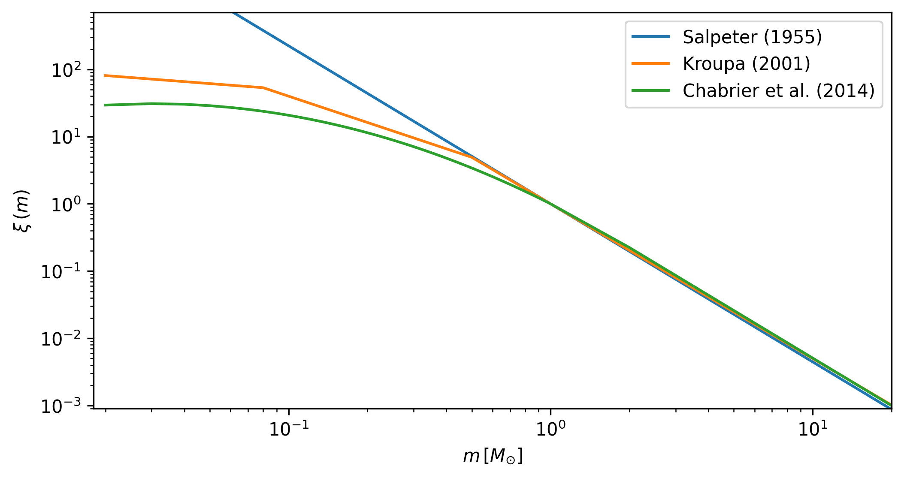

.. _synth_clusters:

Synthetic clusters
##################

The :ref:`synthetic_api` class allows generating synthetic clusters from:

1. an :class:`isochrones` object
2. a :class:`cluster` object
3. a dictionary of fixed fundamental parameters (optional)
4. a dictionary of free fundamental parameters

Defining the object
*******************

To instantiate a :class:`synthetic` object you need to pass the :class:`isochrones`
object previously generated, as explained in the section :ref:`isochronesload`. E.g.:

.. code-block:: python

    import asteca

    # Synthetic clusters object
    synthcl = asteca.synthetic(isochs)

This will load the theoretical isochrones

This basic example uses the default values for all the fixed model parameters, but they
can be set by the user at this stage. These parameters are:

.. code-block:: console

    IMF_name : Initial mass function.
    max_mass : Maximum total initial mass.
    gamma : Distribution function for the mass ratio of the binary systems.
    DR_dist : Distribution function for the differential reddening.

(see :ref:`synthetic_api` for more information on the arguments of the
:class:`synthetic` class)

The ``IMF_name`` and ``max_mass`` parameters are used to generate a sampling from a
given Initial Mass Function. This is done when the :class:`synthetic` object is
created instead of every time a new synthetic cluster is generated, to improve the
performance of the code.

The ``alpha`` and ``gamma`` parameters are related to the details of binary systems
distribution. The first one, ``alpha`` is one of two parameters involved in the function
that 

Calibrating the object
**********************

xxxxx

Generating synthetic clusters
*****************************

xxxxx

Plotting synthetic clusters
***************************

xxxxxx